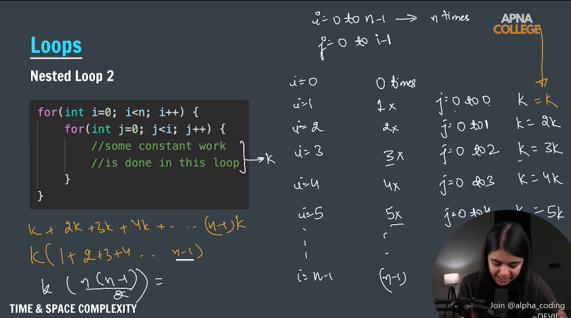

> .java extention to save java file , .cpp (c++) .py (python programming) .c(c programming)

> To Run Java Locally we Need Java JDK in Our System

> Java Is A Typed Language means Need to define type of a variable before creating it

Compile the code with JDK in byte code and run on JVM , JRE (provide external library and validate byte code JVM is a part of JRE AND JRE is a part of JDK)

JDK java development kit provides environment to develop and run java code (jre + development tool )
JRE provide enviroment to run java code (jvm + library)
JVM execute code line by line that is an reason if java as interpreted language

Java can be considered both a compiled and an interpreted language because its source code is first compiled into a binary byte-code. This byte-code runs on the Java Virtual Machine (JVM), which is usually a software-based interpreter

```java
public class JavaBasic{
 public static void main(String args[]){

 }
}
```

> > In java file name and class name should be same

System.out.print("hello world");
System.out.println("hello world");

javac file_name.java To compile and run file

# Variables

## data types in java

1. Primitive
   store data of one type , size depend on type of data type , ex:- int float , double , it start with lower case
2. Non-Primitive
   store data of more then one type , size is not fixed ex:- class array , it start with uppercase

Primitive: Basic types, store actual value (e.g., int, char, boolean)

Non-Primitive: Reference types, store memory address (e.g., String, Array, Object)
Stored in	Stack (primitive)	Heap (reference in stack) (non kj+- primitive)
### Primitive (Store Single data type value)

byte byte a=5; -128 to 127 (256)                 1byte
boolean boolean var=true;                        1byte
short                                            2byte
char char c="a";                                 2byte  
int int a=10;                                    4byte
float float a=10.5;                              4byte
long                                             8byte
double                                           8byte

                    1 byte --> 8 bites                                                

### Non-Primitive (Can Store Multi data type value)

String
Array
Class
Object 
Interface

# Comments

//
/\* \*/

# Take Input From User

import java.util.\*;
Scanner sc=new Scanner(System.in)

1. String str=sc.next()
2. String str=sc.nextLine();
3. int number=sc.nextInt();
4. nextFloat()
5. nextDouble()
6. nextBoolean()
7. nextShort()
8. nextLong()
9. nextByte()

# Type Conversion (Implicit) And Type Casting

Conversion Happen:-

1. type compatible
2. destination type > source typr

> > TYPE conversion can be done with char to int
> > byte --> short --> int --> float --> long --> double

### Type Casting

(int)(999.9f)
exmaple:-

```
float a=25.12;
int b =(int) a
```

### Type Promotion

Java automatically promotes each byte, short, or char operand to int when evaluating an expression,
if one operand is long , float or double the whole expression is promoted to long , float , double respectively

# Operators

symbols that tells compiler to perform some operatios

1. Arithemetic operators (Binay / Uniary / Ternary) Binary --> + ,- \* ,/,% uniary --> ++, -- pre increment and postIncrement , ternary a>b?10:5;
2. Relational Operators
3. Logical Operators == ,!=, > ,< , >= , <=
4. Bitwise Operatos
5. Assignment Operators

# conditional statements

if else

# loop

for(int i =0;i<=10;i++)
int i=1;
while(i<10>){
++i;
}
break; continue;

# function / Methods

block of code that can be used multiple times , help us in achieving reusability

returnType name(){
// body
return statement
}
function that wrote inside a class called as methods

(int a , int b) --> parameters and formal parameters

function(5,10) --> argumanets , actual parameters

# what happen in memory when we call a function

function also occupy space in memory called call stack

# call by value and call by reference

java always call by value , value pass in function is a copy of original one any change made in that will not effect the original one

## Function overloading

- multiple function with same name but different parameters

- differentiate with diff type parameters and no of parameters

It does not depend on return type

## check whether the number is prime or not

```java
public static boolean prime(long num){
if(num<0)
return false;

    // or i<=Math.sqrt(num)
        for(int i=2;i<=num/2;i++){
            if(num%i==0)
            return false;
        }
        return true;

    }
```-

## convert from binary to decimal
```js
public static void binToDec(long a) {
long pow = 0;
long dec = 0;

        while (a > 0) {
            dec+=a%10*(int)Math.pow(2,pow);
            pow++;
            a /= 10;
        }
        System.out.println(dec);
    }
```
## decimal to binary
```js
public static void decimalToBinary(long num) {
long bin = 0;
long pow = 0;
while (num >0) {
bin+=(num%2) * (int)Math.pow(10,pow);
num=num/2;
pow++;
}
System.out.println(bin);
}
```
## hallow rectangle
```js
public static void makeHollowPattern(int totRows, int totCols) {

        for (int i = 1; i <= totRows; i++) {
            for (int j = 1; j <= totCols; j++) {
                if(i==1||i==totRows||j==1||j==totCols){
                    System.err.print("*");
                }else{
                    System.err.print(" ");
                }
            }
            System.out.println();
        }
    }
```
## to print odd things

we need to follow 2i+1 or 2i-1

# Arrays

list of elements of same type plcaed in a contiguous memory location

int newArr[]=new int[arr.length];
int arr[]={1,2,3};

array are pass by reference

arr[0]

# Linear Search

TC -> (O)n
SC ->

import javaj.util.*;

Integer.MAX_VALUE;
Integer.MIN_VALUE;

# Binary Search

mid =(start+end)/2
mid =start + (end-start)/2
```js
public static int binarySearch(int arr[], int key) {

        if (arr.length == 0) {
            System.out.print("Number not found , Beacause array is empty");
        }
        int l = 0;
        int r = arr.length - 1;

        while (l <= r) {
            int mid = (r + l) / 2;

            if (arr[mid] == key) {
                return mid;
            }
            if (arr[mid] < key) {
                l = mid + 1;
            } else {
                r = mid - 1;
            }
        }
        return -1;
    }

TC --> (O)logn
best --> (O)1
worst --> if array size is 8
worst case will be when finding element is at first or at last
8/2-->4 8/2 pow 1
4/2-->2 8/2 pow 2
2/2-->1 8/2 pow 3

n/2 pow k --> logn
```
### reverse an array

```js
public static void ReverseArray(int arr[]){
int a=0;
int b=arr.length;

    while (a<b) {

        int temp=arr[a];
        arr[a]=arr[b-1];
        arr[b-1]=temp;
        a++;
        b--;
    }

}
```

### pairs in an array
```java
static void printPairs(int arr[], int n){
    for (int i = 0; i < n; i++) {
        for (int j = i+1; j < n; j++) {
            System.out.print("(" +  arr[i]+ ", "
                 + arr[j]+ ")"
                + ", ");
        }
    }
}
```

formula (n*(n-1))/2

### print subarray

formula (n*(n+1))/2

Integer.MIN_VALUE
Integer.MAX_VALUE

## Max subarray
Given an array of integers, find the maximum sum of any contiguous subarray
int arr[] = {-2, 1, -3, 4, -1, 2, 1, -5, 4};

PREFIX[END]-PREFIX[START-1]

```js
public static void maxSubarrayPrifix(int arr[]) {

        int newArr[] = new int[arr.length];
        int sum = 0;
        for (int i = 0; i < arr.length; i++) {
            sum += arr[i];
            newArr[i] = sum;

        }

        int maxSum = Integer.MIN_VALUE;
        for (int i = 0; i < arr.length; i++) {
            for (int j = i; j < arr.length; j++) {
                sum=i==0?newArr[j]:newArr[j]-newArr[i-1];
                if(maxSum<sum){
                    maxSum=sum;
                }

            }
        }
        System.out.println(maxSum);
    }
```
## Kadane's algorithm
Given an array of integers (which may include negative numbers), find the contiguous subarray that has the maximum sum and return that sum.

[-2,-3,4,-1,-2,1,5,-3]

```java

   public static void KadaneAlgo(int arr[]) {
        int max = Integer.MIN_VALUE;
        int sum = 0;

        for (int i = 0; i < arr.length; i++) {
            sum+=arr[i];
            if(sum>max){
                max=sum;
            }
            if(sum<0){
                sum=0;
            }
        }
        System.out.println(max);

    }
```

## trapping rainwater
Given an array arr[] representing the height of bars in a histogram where the width of each bar is 1, compute how much water it can trap after raining."
int arr[] = {4,2,0,3,2,5};

```java
 public static void rainWaterTrapping(int arr[]) {
        int leftMax[] = new int[arr.length];
        int rightMax[] = new int[arr.length];
        int totalWater = 0;
        int max = Integer.MIN_VALUE;
        for (int i = 0; i < arr.length; i++) {
            if (arr[i] > max) {
                max = arr[i];

            }
            leftMax[i] = max;
        }
        max = Integer.MIN_VALUE;
        for (int i = arr.length - 1; i >= 0; i--) {
            if (arr[i] > max) {
                max = arr[i];

            }
            rightMax[i] = max;
        }
        for (int i = 0; i < arr.length; i++) {
            int value = Math.min(leftMax[i], rightMax[i])-arr[i] ;
            if (value > 0) {
                totalWater += value;
            }
        }
        System.out.println(totalWater+"this is the total water");

    }
```

## Best time to buy and sell stock
You are given an array arr[], where arr[i] represents the stock price on the iᵗʰ day. You can buy and sell the stock only once. Find the maximum profit you can achieve. If no profit can be made, return 0

int arr[] = {7, 1, 5, 3, 6, 4};
int arr[] = {7, 6, 4, 3, 1};
System.out.println(bestTimeToBuyAndSell(arr));

```js
public static int bestTimeToBuyAndSell(int arr[]) {
        int min=arr[0];
        int maxEarn=0;
        if(arr.length<2)
        return maxEarn;

        for (int i = 1; i < arr.length; i++) {
            if(arr[i]-min>maxEarn){
                maxEarn=arr[i]-min;
            }
            if(arr[i]<min){
                min=arr[i];
            }
        }
        return maxEarn;
    }
```

# Sorting

arranging things in a order , it can be decrease and increase

1. Bubble Sort best time :- best O(n) worst O(n2)
2. Selection Sort :-best O(n2) worst O(n2)
3. Insertion Sort :- best O(n2) worst O(n2)
4. Counting Sort 
O(n+k)
Where:
n is the number of elements in the input array.
k is the range of input values (maximum value in the array).

-- divide and conquer --

5. Merge Sort
6. Quick Sort

##### 1> Bubble sort ------------->
<!-- numbers = [64, 34, 25, 12, 22, 11, 90] -->
```java
            for (int i = 0; i < arr.length - 1; i++) {
                        int swap = 0;
                        for (int j = 1; j < arr.length - i; j++) {
                            if (arr[j - 1] > arr[j]) {
                                int temp = arr[j];
                                arr[j] = arr[j - 1];
                                arr[j - 1] = temp;
                                swap++;
                            }
                        }
                        if (swap == 0) {
                            break;
                        }
                        System.out.println(i);

                    }
```

##### 2 Selection Sort ---------------->

```java
 public static void selctionSort(int arr[]) {

        for (int i = 0; i < arr.length - 1; i++) {
            int min = i;
            for (int j = i + 1; j < arr.length; j++) {
                if(arr[j]<arr[min]){
                    min=j;
                }

            }
            if (i!= min){
                int temp=arr[i];
                arr[i]=arr[min];
                arr[min]=temp;
            }
        }

    }
```

##### 3> Insersion Sort ----------------->

```java
public static void InsertionSort(int arr[]) {

        for (int i = 1; i < arr.length; i++) {
            int temp=arr[i];
            int j = i-1;
            while (j >= 0&&arr[j]>temp) {
                arr[j+1]=arr[j];
                j--;
            }

            if(j+1!=i){
                arr[j+1]=temp;
            }
        }
    }
```

##### 4> Count Sort -------------------->

```java
public static void CountingSort(int arr[]) {
        int max = 0;
        for (int i = 0; i < arr.length; i++) {
            if (arr[i] > max) {
                max = arr[i];
            }
        }
        int count[] = new int[max+1];
        for (int j = 0; j < arr.length; j++) {
            count[arr[j]]++;

        }
        int k = 0;
        for (int i = 0; i < count.length; i++) {
            while (count[i] > 0) {
                arr[k] = i;
                --count[i];
                k++;
            }

        }

    }
```
> Divide and Conquer
##### 5> Merge Sort ------------> O(nlogn)

mid = (startIndex+endIndex)/2

this is good when start index and end index are too large 
mid = startIndex+(endIndex-startIndex)/2

```java
nlongn

public static void mergeSort(int s, int e, int arr[]) {
        if (s >= e) {
            return;
        }

        int mid = s + (e - s) / 2;

        mergeSort(s, mid, arr);
        mergeSort(mid + 1, e, arr);

        sortTwoArray(arr, s, mid, e);
    }

    public static void sortTwoArray(int arr[], int si, int mid, int ei) {
        int temp[] = new int[ei - si + 1];
        int i = si;
        int j = mid + 1;
        int k = 0;

        while (i <= mid && j <= ei) {
            if (arr[i] < arr[j]) {
                temp[k++] = arr[i++];
            } else {
                temp[k++] = arr[j++];
            }
        }

        while (i <= mid) {
            temp[k++] = arr[i++];
        }

        while (j <= ei) {
            temp[k++] = arr[j++];
        }

        for (k = 0, i = si; k < temp.length; k++, i++) {
            arr[i] = temp[k];
        }
    }


```
##### 6> Quick Sort ------------> 
average case -> O(nlogn)
in worst case -> O(n2)

use no array

work in pivot & partition logic

```java 
   public static void quickSort(int[] arr, int s, int e) {
      if (s >= e)
         return;

      int pivot = sortAndGetPivot(arr, s, e);
      quickSort(arr, s, pivot - 1);
      quickSort(arr, pivot + 1, e);
   }

   public static int sortAndGetPivot(int[] arr, int s, int e) {
      int pivot = arr[e];
      int i = s - 1;

      for (int j = s; j < e; j++) {
         if (arr[j] <= pivot) {
            i++;
            int temp = arr[j];
            arr[j] = arr[i];
            arr[i] = temp;
         }
      }
      i++;
      int temp = pivot;
      arr[e] = arr[i];
      arr[i] = temp;
      return i;
   }
```

> worst case occurs  when pivot is always the smallest or the largest element. (means already sorted in increasing , decreasing)

on each level the traverse goes n ->n n-1 n-2 ...n-(n-1) --> n(n+1)/2 ->O(n2) 

## sorted and rotate array  ------>
sorted,rotated array with distinct numbers ( in ascending order ) it is rotated at a pivot point. find the index of given element.

[4,5,6,7,0,1,2]  target:0 output:4

using modified binary search

1. Find `mid`, check if `arr[mid] == tar`.
2. If left half is sorted (`arr[si] ≤ arr[mid]`):
   - Search left if `tar` is in range (`arr[si] ≤ tar ≤ arr[mid]`), else search right.
3. else Search right if `tar` is in range (`arr[mid] ≤ tar ≤ arr[ei]`), else search left.
4. Repeat until found or return `-1`.
**Time Complexity:** `O(log n)`
[4,5,6,7,0,1,2]
```java
  public static int targetsearch(int arr[], int tar, int si, int ei) {
      if (si > ei) {
         return -1;
      }
      int mid = si + (ei - si) / 2;
      if (arr[mid] == tar)
         return mid;
      if (arr[si] <= arr[mid]) {
         if (arr[si] <= tar && tar <= arr[mid]) {
            return targetsearch(arr, tar, si, mid-1);
         } else {
            return targetsearch(arr, tar, mid + 1, ei);
         }
      } else {
         if (arr[mid] <= tar && tar <= arr[ei]) {
            return targetsearch(arr, tar, mid + 1, ei);
         } else {
            return targetsearch(arr, tar, si, mid - 1);
         }
      }
   }
```

# 2-D Array

we have 1D 2D 3D ---ND Array
nD array generally used in AI and Ml
  0 1 2
0
1
2

n*m n -> row and m->column
totol number of cell =n*m;

n --> matrix.length m --> matrix[0].length
int matrix[][] new int[3][3]

## how matrix store in memory

row major and column major
1 2 3
4 5 6
7 8 9
row major --> [1][2][3] [4][5][6] [7][8][9]
column major -->
[1]
[4]
[7]

[2]
[5]
[8]

[3]
[6]
[9]

## spiral matrix
Given a 2D array (matrix), print its elements in spiral order starting from the top-left corner.

1   2  3  4
5   6  7  8
9  10 11 12
13 14 15 16

```java
public static void SpiralMatrix(int matrix[][]) {
        int row = 0;
        int col = 0;
        int rowend = matrix.length - 1;
        int colend = matrix[0].length - 1;

        while (row <= rowend &&  col <= colend) {

            for (int i = row; i <= colend; i++) {
                if (row == rowend)
                break;
                System.out.print(matrix[row][i] + " ");

            }
            for (int i = row + 1; i <= rowend; i++) {

                System.out.print(matrix[i][colend] + " ");

            }
            for (int i = colend - 1; i >= col; i--) {
                if (row == colend)
                    break;
                System.out.print(matrix[rowend][i] + " ");

            }
            for (int i = rowend - 1; i > row; i--) {

                System.out.print(matrix[i][col] + " ");

            }

            row++;
            rowend--;
            col++;
            colend--;
        }

    }
```

## diagonal som

primary and secondary

in primary i=j
in secondary i+j==matrix.length-1 or matrix[0].length-1;

```java
basic solution  O(n2)
for (int i = 0; i < matrix.length; i++) {
            for (int j = 0; j < matrix[0].length; j++) {
                if (i == j) {
                    sum += matrix[i][j];
                }

                if (i + j == matrix.length - 1 && i != j) {
                    sum += matrix[i][j];
                }
            }
        }

optimise O(n)

 int sum = 0;

        for (int i = 0; i < matrix.length; i++) {

            sum += matrix[i][i];

            if (i != matrix.length - 1 - i) {
                sum += matrix[i][matrix.length - 1 - i];
            }
        }
        System.out.println(sum);
        return sum;

```

## Search in Sorted Matrix

staircase search
ends when i=0 to n-1
or j=m-1 to 0

```java
O(n+m) worst case
public static void shareSearch(int matrix[][]) {
        int i = 0;
        int j = matrix[0].length-1;
        int find = 16;
        while (i < matrix.length && j >= 0) {
            if (matrix[i][j] == find) {
                System.out.println(i + " " + j);
                return;
            }
            if (matrix[i][j] > find) {
             j--;
                continue;
            }
            if(matrix[i][j]<find){
               i++;
            }

        }
        System.out.println("No Number Find");
        return ;

    }

```

## String

String str="abcs";
String str2=new String("xyz");

java string are IMMUTABLE ( CAN NOT UPDATE only reassign a new value)

Scanner sc=New Scanner(System.in)
String name =sc.next();
Or
String name =sc.nextLine();

--> string length
str.length()
--> concat string
str1.concat(str2) or str1 + str2
--> charAt(0)
str.charAt(0)

### palindrome in string

noon
if(str.charAt(i)==sta.chatAt(n-i-1))
or
to reduce number of chances
if(str.charAt(i)!==sta.chatAt(n-i-1))

### Short path
You are given a string str consisting of characters 'N', 'S', 'E', and 'W'. Each character represents a move in the respective direction on a 2D Cartesian plane:

'N' moves 1 unit north (y increases),

'S' moves 1 unit south (y decreases),

'E' moves 1 unit east (x increases),

'W' moves 1 unit west (x decreases).

Assume the person starts at the origin (0, 0). After performing all the moves described in the string, calculate and return the shortest straight-line distance (Euclidean distance) from the starting point to the final position.

Input:  "WNEENESENNN"
Output: 5.0


```java
public static float findShortDis(String str) {
        int x = 0;
        int y = 0;

        for (int i = 0; i < str.length(); i++) {
            char direction = str.charAt(i);

            if (direction == 'W') { // West
                x++;
            } else if (direction == 'E') { // East
                x--;
            } else if (direction == 'N') { // North
                y++;
            } else if (direction == 'S') { // South
                y--;
            }
        }
        int X2 = x * x;
        int Y2 = y * y;
        return (float) Math.sqrt(X2 + Y2);
    }
```

String comparison
str.equals(str)

"HelloWord"
substring ="Hel"
subsequence ="lod"

.substring(startIndex,endIndex);

str1.compareTo(str2)
0 => equal
-1 str1<str2
1 str1>str2

.comapreToIgnoreCase

### why string are immutable

heap memory and stack memory
String str="sachin";

stack memory

---

| |  
| str |  
| |  
| |

---

heap memory / string pool / inter pool+

---

| |  
| sachin |  
| |  
| |

---

because the point to an address

str=str+"a"

here this is copying and adding a and storing
this genrally take time as length of string

# StirngBuilder

StringBuilder str = new StringBuilder("this");

// Append
str.append(" is Java");
System.out.println(str);  // this is Java

// Insert
str.insert(4, " cool");
System.out.println(str);  // this cool is Java

// Delete
str.delete(4, 9);
System.out.println(str);  // this is Java

// Replace
str.replace(5, 7, "was");
System.out.println(str);  // this was Java

// Reverse
str.reverse();
System.out.println(str);  // avaJ saw si siht

// Convert to String
String normalString = str.toString();


### change first letter to uppercse in a sentence

## String compression

aaabbcccdd a3b2c3d2
```java
String newStrt="";
for(int i=0;i<str.length();i++){
Integer count=1;
while(i<str.length-1&&str.charAt(i)==str.charAt(i+1)){
count++;
i++;
}
newStr+=str.charAt(i);
if(count>1){
newStr+=count.toString();
}
}
return newStr;
```

# Bit Manipulation

0 -- 000
1 -- 001
2 -- 10
3 -- 011
4 -- 100
5 -- 101
6 -- 110
7 -- 111
8 -- 1000

## bitwise operator

& AND 0 & 1 -> 0 1 & 0 -> 1 1 & 1 -> 1

| Or 0 | 1 -> 1 0 | 0 -> 0 1 | 1 -> 1

^ XOR 0 ^ 1 -> 1 0 ^ 0 -> 0 1 ^ 1 -> 0

~ one's complement / not operator ~0 --> 1 ~1 --> 0

<< left shit shift all to left and remaining will contain 0 3<<2 shift by 2 formula a*2^b

> > right shift shift all to right and remaining will contain 0 3>>2 shift by 2 formula a/2^b

00000101
0 -> positive number
1 -> negative number

### check odd or even

```java
public static void checkWhetherOddOrEven(int n) {
        int bitMask = 1;
        if ((n & bitMask) == 0) {
            System.out.println("Even Number");
        }else{
            System.out.println("Odd Number");
        }
    }
```

## git operation

1. Get ith bit

```java
 public static int ithValue(int no,int po){
       int bitMask=1<<po;
       return (no&bitMask)==0?0:1;
    }
```

2. Set ith Bit ( make 1 at ith position )

```java
 public static int setIth(int n , int p){
        int bitMask=1<<p;
        return  n|bitMask;
    }
```

3. Clear ith bit

```java
  public static int clearIth(int n , int p){
        int bitMask=~(1<<p);
        return  n & bitMask;
    }
```

4. Update ith bit
   if(newBit==0){
   clearBit
   }else{
   setBit
   }

or

n=clearBut(n,i);
int bitmask=newBit<<i;
return n|bitMask;

5. Clear Last i bits

```java
    public static int clearLastITh(int n, int i){
      int bitWise=(~0)<<i;
      return n & bitWise;
    }
```

6. Clear Range of bits i=2, j=7

2^1-1 --> 1 --> 01
2^2-1 --> 3 --> 011
2^3-1 --> 7 --> 0111
2^4-1 --> 15 --> 0111

2^b --> 1 << b

```java
public static int clearRangeOfBit(int n, int s, int e) {
        int bitMask1 = (~0) << (e + 1);
        int bitMask2 = (int) Math.pow(2, s) - 1;
        // or
        // int bitMask2 =(1<<s)-1;
        int newBitMask= bitMask1|bitMask2;

        return n&newBitMask;
    }
```

7. Check if a number is a power of 2 or not
   2^2 --> 4
   2^3 --> 8

8&8-1 or 8&7 --> 0 then it is power of 2

8. Count set bits in a number
   1010 -> no of set bit is 2

16 --> 10000 -> length would be log16 -> 4+1

> > length --> logn + 1

let count =0;
while(n>0){
if((n&1)!=0){
count++;
}
n=n>>1;
}
return count

9. fast exponentiation
   a*n --> a*a*a*---n ---> O(n)

O(n) ---> O(logn) // using fast exponentiation

```java
 public statuc int fatExpo(int a,int n){
        int ans =1;
        while(n>0){
            if((n&1)!=0){
                ans=ans*a;
            }
            a=a*a;
            n=n>>1;
        }
    }
```

# OOP ( Object Orineted programming )

## Classes & Object

object --> entites int he world
classes --> group / collection of these entities

pen
blue is property

car is an object it color and size is property and it start is function/behaviour

class
public class Opps{

}

object
className p1=new className()
Pen p1=new Pen();

p1.functionName()
p1.valriableName
p1.variableName=value;

## getters & setters

Get: function/behaviour in object to return the value
Set: function/behaviour in object to modify the value

this: this leyword is use to refer to the curent object
 
## 4 pillars in oops

1. Encapsulation
2. Inheritance
3. Abstraction
4. Polymorphism

## Encapsulation

encapsulation is defined as the wrapping up of data & methods under a single unit. it also implements data hiding.

access specifier

1. private
2. default
3. protected
4. public

## constructor

constructor is a special method which is invoked automatically at the time of object creation

it have the same name as class

class Student{
String name ;
int roll;

    Student(){

    }

}

### type of constructor

1. non parameterized
   Pen()

2. parameterized
   Pen(sachin)

3. copy constructor
   have to create manually
   copy of one object property to another

Student s1=new Student();
s1.name="shradha";
s1.roll=456;
s1.password="abcd";

Student s2=new Student(s1);

Student(Student s1){
this.name=s1.name;
this.roll=s1.roll;
}

### constructor overloading

class Student{

    Student(){

    }
    Student(String name){

    }

}

### Shallow & deep copy & lazy copy

### destructors

java have garbage collector
that done automatically are known as destructors

## Inheritance

inheritance is when properties & methods of base calss passed on to a derived class

base class / parent class

child class / derived class

class fish extends animal{

}

### type of inheritance

1. Single level inheritance A --> B
2. Multi level inheritance A --> B ---> C
3. Hierarchial Inheritance  
    A
   / \
   / \
   B C
4. Hybrid Inheritance
A combination of two or more types of inheritance.
```java
interface A {
    void show();
}

interface B {
    void display();
}

class C implements A, B {
    public void show() {}
    public void display() {}
}
```
5. Multiple Inheritance :- java does not have direct way to achieve Multiple inheritance
   but we can achive indirectly
   A B
   \ /
   \ /
   C

can be achieve through Interface

## Plymorphism

1. compile Time Polymorphism (static)
   (i). method overloading :- mutilple function with the same name but different oarameters

sun(int a , int b)
sum(float a, float b)

2. run time pilymorphism (dynamic)
   (ii). method overriding
   parent and child classes both contain the same function with a different definition

## packages in java

package is a group of similar types of classes, interfaces and sub-packages.
--> build In packages / user defined packages

## Abstarction

Hiding all the unnecessary details and shiwing only the important parts to the user.

1. Abstract classes

(i). cannot create an instance of abstract class
(ii). can have abstract/non-abstract methods
(iiI). can have construtors
```java
abstract class Animal {
    abstract void sound();  

    void sleep() {   
        System.out.println("Sleeping...");
    }
}

class Dog extends Animal {
    void sound() {
        System.out.println("Bark");
    }
}


abstract class A{

}
abstract void eat(){

}

abstract class Animal{
String color;
Animal(){
color="brown";
}
void ear(){

    }
    abstract void walk();

}

class Horse extends Animal{
void walk(){

    }

}
```

2. Interfaces
   Interface is a bule print of a class
   and to achive total abstraction

All methods are public , abstract & without implementation
used to achive total abstraction
variables in the interface are final, public and static

interface ChessPlayer{
void moves();
}
class Queen implements ChessPlayer{

}

interface A{
}
interface B{}

class C implements A,B{

}
An interface in Java is a blueprint of a class. It is used to achieve abstraction and multiple inheritance. Interfaces define what a class should do but not how it does it.


## Static Keyword

Static keyword in java is used to share the same variable or method of a given class

- Properties ( variables)
- Function
- Bloacks { { } }
- Nested Classes
  class A{

      class B{

      }

  }

class Student{
String name;
int roll;

static String schollName;
String name;
int roll;

static String schoolName;

void setName(){

}
String getName(){

}

}

Student s =new Student();
Student.schollName="sachin";

- if a Object of class change static varibale then it will be changes for all object and upcomming objects
  and memory alocation for that ocure once
  for all object

* Static Variables
A static variable is shared among all instances of a class.

```java
class Counter {
    static int count = 0; // Static variable

    public Counter() {
        count++; // Increments the shared static variable
    }
}

public class Main {
    public static void main(String[] args) {
        Counter c1 = new Counter();
        Counter c2 = new Counter();
        Counter c3 = new Counter();

        System.out.println(Counter.count); // Output: 3
    }
}
```
* Static Methods
A static method belongs to the class and can be called without an object.

```java
class MathUtils {
    static int square(int x) { 
        return x * x;
    }
}

public class Main {
    public static void main(String[] args) {
        int result = MathUtils.square(5); // Call without an object
        System.out.println(result); // Output: 25
    }
}
```

* Static Blocks
A static block is used to initialize static variables when the class is loaded.
```java
class StaticBlockExample {
    static int x;

    static { // Static block
        x = 10;
        System.out.println("Static block executed");
    }
}

public class Main {
    public static void main(String[] args) {
        System.out.println(StaticBlockExample.x); // Output: Static block executed, then 10
    }
}
```

* Static Nested Classes
A static nested class can be accessed without creating an object of the enclosing class.
```java
class OuterClass {
    static class NestedClass { // Static nested class
        void display() {
            System.out.println("Inside static nested class");
        }
    }
}

public class Main {
    public static void main(String[] args) {
        OuterClass.NestedClass nested = new OuterClass.NestedClass(); // No instance of OuterClass needed
        nested.display();
    }
}

```
## super keyword

super keyword is used to refer immediate parent class object

to access parent's properties
to access parent's function
to access parent's constructor

```java
class Animal {
    String type = "Animal";

    Animal() {
        System.out.println("Animal constructor called");
    }

    void sound() {
        System.out.println("Animal makes a sound");
    }
}

class Dog extends Animal {
    String type = "Dog";

    Dog() {
        super();  // Calling parent constructor
        System.out.println("Dog constructor called");
    }

    void showType() {
        System.out.println("Type from child class: " + type);       // Dog
        System.out.println("Type from parent class: " + super.type); // Animal
    }

    @Override
    void sound() {
        super.sound();  // Calling parent method
        System.out.println("Dog barks");
    }
}

public class Main {
    public static void main(String[] args) {
        Dog dog = new Dog();
        dog.showType();  // Access parent and child variables
        dog.sound();     // Call parent and child method
    }
}

```

## constructor chaining
```java
class Example {
    Example() {
        this(10);  // Calls constructor with int parameter
        System.out.println("No-arg constructor");
    }

    Example(int x) {
        System.out.println("Constructor with parameter: " + x);
    }
}
```

## Extra

- private and protected class are useless
  class can not private and protected

- can use private and protected in nested class

- class A{

}
class B extends A{

}
A a=new B()

# Recursion

is a method of solving a computational problem where the solution depends on solutions to smaller instance os the same problem

1. base case or final case
2. code
3. call again

call stack
| f(1) |
| f(2) |
| f(3) |
| f(4) |
| f(5) |
|**\_\_\_\_**|

stack overflow
no memory

## sum of n natural number

O(n-1) --> O(n)

```java

    public static int recurssionSum(int n){
        if(n<=0)
        return n;
        if(n==1)
        return 1;

        return n+recurssionSum(n-1);
    }

```

## print nth fibonacci number

0 1 1 2 3 5 8 13 21
space --> O(n)
time ---> O (2^n)

```java
    public static int nthFibonacci(int n){
        if(n==0||n==1)
        return n;
        return nthFibonacci(n-1)+nthFibonacci(n-2);

    }
```

## check if a given array is sorted or not

Tc -> O(n)
Sc -> O(n)

```java

    public static boolean CheckArraysorted(int arr[],int i){
        if(i==arr.length-1){
            return true;
        }
        if(arr[i]>arr[i+1])
        return false;

        return CheckArraysorted(arr, i+1);
    }
```

## First ocucrence of an element in an array

Tc -> O(n)
Sc -> O(n)

```java
public static int findNumber(int arr[], int i, int k) {
       if (i >= arr.length) {
           return -1;
       }
       if (arr[i] == k) {
           return i;
       }
       return findNumber(arr, i+1, k);

   }
```

## Last occurence of an element in an array

```java
Tc -> O(n)
Sc -> O(n)
public static int lastOcccurence(int arr[], int i, int k) {
        if (i == arr.length) {
            return -1;
        }
        int isFound = lastOcccurence(arr, i + 1, k);
        if (isFound == -1 && arr[i] == k) {
            return i;
        }
        return isFound;
    }
```

## Power x to the power of n

Tc -> O(n)
Sc -> O(n)

```java
public static int power(int x,int n){
    if(n==0){
        return 1;
    }
    return x*power(x,n-1);
}
```

### Optimised Approach

```java
public statc int optimisedPower(int a , int n){
    if(n==0){
        return 1;
    }
    int halfPower=optimisedPower(a,n/2);
    int halfPowerSq=halfPower*halfPower;

    if(n%2!=0){
        halPowerSq=a*halpPowerSq;
    }
    return halfPowerSq;
}
```

## Tiling power

given a 2*n board and titles of asize 2*1 count the number of ways to the given board using the 2\*1 titles (A tile can either be olaced horizontally or vertically)

```java
    public static int tileProblem(int n) {
        if(n<=1)
        return 1;
        return tileProblem(n-1)+tileProblem(n-2);
    }
```

## Remove dublicate in a string a-z

"appnnacollege"

```java
 public class RemoveDuplicates {
    public static void removeDuplicate(String str, int idx, StringBuilder newStr, boolean[] map) {
        if (idx == str.length()) {
            System.out.println(newStr);
            return;
        }

        char currChar = str.charAt(idx);
        if (map[currChar - 'a']) {
            // Current char already exists, skip it
            removeDuplicate(str, idx + 1, newStr, map);
        } else {
            // Include this character
            map[currChar - 'a'] = true;
            removeDuplicate(str, idx + 1, newStr.append(currChar), map);
        }
    }

    public static void main(String[] args) {
        String str = "aabccbd";
        boolean[] map = new boolean[26]; // For lowercase a-z
        removeDuplicate(str, 0, new StringBuilder(), map);
    }
}

```

## Friends pairing problem

given n friends, each one can remain single or can be paired up with some other friends. Each friends can be paired only once. find out the totola number of ways in which friends can remain single or can be paired up.

```java
public static long findTotalPair(long n) {
        if (n < 3) {
            return n;
        }
        return findTotalPair(n-1)+(n-1)*findTotalPair(n-2);
    }

```

## BInary String Problem

print all binary string of size N without consecutive ones.

```java
public static void printBinStrings(int n,int lastPlace,String str){
  if(n==0){
    System.out.println(str);
    return;
  }

  printBinStrngs(n-1,0,str+"0")
if(lastPlace==0){
    printBinStrings(n-1,1,str+"1");
}

}


```

# Time & space complexity
time taken by the proccess with respect to t  ime
#### Bog 0 Notation
O -> upper bound
time and input size relation




 
###### time complexity in recursion
Work done  =no of calls * time in each call;
 
space complexity is total stack created * space per level

> ----------------------------------------Till Recursion---------------------------------------------