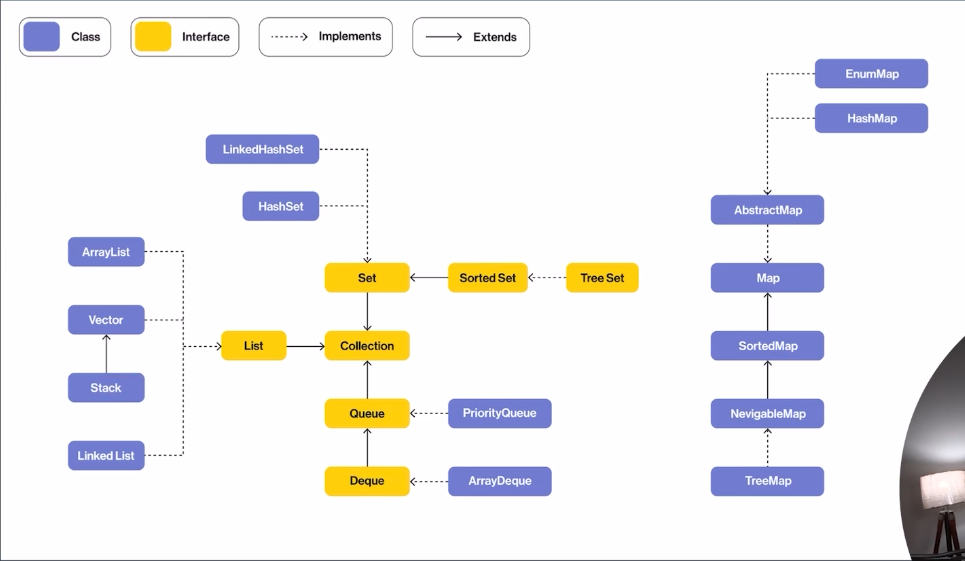
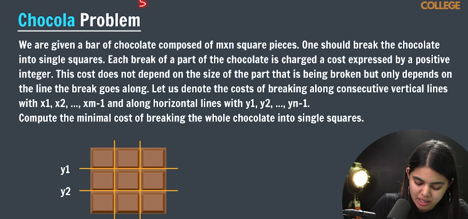

# Bracktracking

##### types of backtracking

1. decision ( yes or no )
2. optimization ( get optimise one )
3. enumeration ( listing )

### backtracking on an array

TC --> O(n) SC --> O(n)

```java
   public static void backtrackArray(int[] arr,int i){
      if(i>=arr.length){
         return;
      }
      arr[i]=i+1;
      backtrackArray(arr, i+1);
      arr[i]=arr[i]-2;
   }
```

or

```java
   public static void backtrackArray(int[] arr,int i){
      if(i<arr.length){
         arr[i]=i+1;
      backtrackArray(arr, i+1);
      arr[i]=arr[i]-2;
      }
   }
```

```java
   public static void backtrackArray(int[] arr,int i){
      if(i>=arr.length){
    return;
      }

        arr[i]=i+1;
      backtrackArray(arr, i+1);
      arr[i]=arr[i]-2;
   }
```

## String Subset

"abc" -> a b c ab bc ac abc (extra "" null set )

total subset =2^n or 2^n -1 ( if null set is not consider ) work for string and array

TC --> O(n*2^n)
total substring --> 2^n * time to cat 1 sub string

SC --> O(n)

```java

   public static void StringSubSet(String str, String ans, int i) {
      if (i == str.length()) {
         if (ans.length() != 0)
            System.out.println(ans);
         return;
      }

      StringSubSet(str, ans + str.charAt(i), i + 1);
      StringSubSet(str, ans, i + 1);
   }

```

## FInd & Print all permutaion of a string "abc" -> abc,acb,bac,bca,cab,cba

for n elements -> total permutation are n!;

O(n\*n!)

```java
   public static void PermutationPair(String str,String ans) {
      if(str.length()==0){
         System.out.println(ans);
         return;
      }

      for(int i=0;i<str.length();i++){
         char ch=str.charAt(i);

        String newstr=str.substring(0, i)+str.substring(i+1);
         PermutationPair(newstr, ans+ch);
      }

   }
```

## N queens

place N queens on an N\*N chessboard such that no 2 queens can attack each other
N=4

all solution
yes / no
count solution

```java

    public static boolean isSafe(char[][] check,int i,int j) {
        for(int row=i-1;row>=0;row--){
            if(check[row][j]=='Q'){
                return false;
            }
        }

        for(int row=i-1,col=j+1;row>=0&&col<check[0].length;row--,col++){
            if(check[row][col]=='Q'){
                return false;
            }
        }

        for(int row=i-1,col=j-1;row>=0&&col>=0;row--,col--){
            if(check[row][col]=='Q'){
                return false;
            }
        }
        return true;
    }

    public static void Nqueen(char[][] board, int i) {

        if(i==board.length){
         printBoard(board);
         return;
        }

        for (int j = 0; j < board[0].length; j++) {
            if(isSafe(board, i, j)){
                board[i][j] = 'Q';
                Nqueen(board, i + 1);
                board[i][j] = '.';
            }
        }
        return ;

    }

    public static  void printBoard(char[][] board){
        System.out.println("-----------");
        for(int i=0;i<board.length;i++){
            for(int j=0;j<board[0].length;j++){
            System.out.print(board[i][j]);
            }
            System.out.println("");
        }

    }

```

## Count N queens

```java

    public static boolean isSafe(char[][] check,int i,int j) {
        for(int row=i-1;row>=0;row--){
            if(check[row][j]=='Q'){
                return false;
            }
        }

        for(int row=i-1,col=j+1;row>=0&&col<check[0].length;row--,col++){
            if(check[row][col]=='Q'){
                return false;
            }
        }

        for(int row=i-1,col=j-1;row>=0&&col>=0;row--,col--){
            if(check[row][col]=='Q'){
                return false;
            }
        }
        return true;
    }

    public static void Nqueen(char[][] board, int i) {

        if(i==board.length){
count ++;
        }

        for (int j = 0; j < board[0].length; j++) {
            if(isSafe(board, i, j)){
                board[i][j] = 'Q';
                Nqueen(board, i + 1);
                board[i][j] = '.';
            }
        }
        return ;

    }

    public static  void printBoard(char[][] board){
        System.out.println("-----------");
        for(int i=0;i<board.length;i++){
            for(int j=0;j<board[0].length;j++){
            System.out.print(board[i][j]);
            }
            System.out.println("");
        }

    }

static int count =0;
```

## N-Queens -print 1 solution

```java

    public static boolean isSafe(char[][] check,int i,int j) {
        for(int row=i-1;row>=0;row--){
            if(check[row][j]=='Q'){
                return false;
            }
        }

        for(int row=i-1,col=j+1;row>=0&&col<check[0].length;row--,col++){
            if(check[row][col]=='Q'){
                return false;
            }
        }

        for(int row=i-1,col=j-1;row>=0&&col>=0;row--,col--){
            if(check[row][col]=='Q'){
                return false;
            }
        }
        return true;
    }

    public static boolean Nqueen(char[][] board, int i) {

        if(i==board.length){
return true;
        }

        for (int j = 0; j < board[0].length; j++) {
            if(isSafe(board, i, j)){
                board[i][j] = 'Q';
                if(Nqueen(board, i + 1)){
                  return true;
                }

            }
              board[i][j] = '.';
        }
        return false ;

    }

    public static  void printBoard(char[][] board){
        System.out.println("-----------");
        for(int i=0;i<board.length;i++){
            for(int j=0;j<board[0].length;j++){
            System.out.print(board[i][j]);
            }
            System.out.println("");
        }

    }

```

## Grid ways

Find number if ways to reach from (0,0) to (N-1,M-1) in a N\*M grid. allowed moves - right or down

```java
public static int gridWays(int i,int j, int n,int m){
        if(i==n-1&&j==m-1){
            return 1;
        }else if(i==n||j==n){
            return 0;
        }

        int w1=gridWays(i+1,j,n,m);
        int w2=gridWays(i,j+1,n,m);
        return w1+w2;
    }

     public static void main(String[] args) {
        int n=3,m=3;
        System.out.println(gridWays(0,0,n,m));

    }
```

need to trace atleast n+m-1
tc=O(2^n+m)

## Math trick for linear time

total characters (n-1) + (m-1)

permutaion of there possible pattern
(n-1+m-1)!/(n-1)!(m-1)!

## Sudoku

write a function to complete a sudoku . ( yes or no)


```java
public static boolean sudokuSolver(int sudoku[][], int row, int col) {
        if(row==9){
            return true;
        }
        int nextRow = row, nextCol = col + 1;
        if (col + 1 == 9) {
            nextRow = row + 1;
            nextCol = 0;
        }
        if(sudoku[row][col]!=0){
            return sudokuSolver(sudoku, nextRow, nextCol);
        }
        for (int digit = 1; digit <= 9; digit++) {
            if (isSafe(sudoku, row, col, digit)) {
                sudoku[row][col] = digit;
                if(sudokuSolver(sudoku, nextRow, nextCol)){
                    return true;
                }
                sudoku[row][col]=0;
            }
        }
            return false;
    }
    public static boolean isSafe(int sudoku[][], int row, int col,int digit){
         for(int i=0;i<=0;i++){
            if(sudoku[i][col]==digit){
                return false;
            }
         }

         for(int j=0;j<=0;j++){
            if(sudoku[row][j]==digit){
                return false;
            }
         }

         int sr=(row/3)*3;
         int sc=(col/3)*3;

         for(int i=sr;i<sr+3;i++){
            for(int j=sc;j<sc+3;j++){
                if(sudoku[i][j]==digit){
                    return false;
                }
            }
        }

        return true;
    }

    public static void main(String[] args) {
        int sudoku[][] = { { 0, 0, 8, 0, 0, 0, 0, 0, 0 }, { 4, 9, 0, 1, 5, 7, 0, 0, 2 }, { 0, 0, 3, 0, 0, 4, 1, 9, 0 },
                { 1, 8, 5, 0, 6, 0, 0, 2, 0 }, { 0, 0, 0, 0, 2, 0, 0, 6, 0 }, { 9, 6, 0, 4, 0, 5, 3, 0, 0 },
                { 0, 3, 0, 0, 7, 2, 0, 0, 4 }, { 0, 4, 9, 0, 3, 0, 0, 5, 7 }, { 8, 2, 7, 0, 0, 9, 0, 1, 3 } };

```

# ArrayList

in build data strucuture and a linear type

Array

- fixed size
- primitive data types can be stored

ArrayList

- dynamic size
- primitive data types
  can't be stored directly

store object of a class

import java.util.ArrayList;
ArrayList<type> list

ArrayList<String> list =new ArrayList<>()
ArrayList<Integer> list2 =new ArrayList<>()
ArrayList<Boolean> list3 =new ArrayList<>()

Operations :-

-> Add Element O(1) list.add(1);
System.ot.println(list) [1]

--> add at a index O(n)
list.add(index,value);
list.add(0,9)

-> Get Element O(1)
list.get(index)

-> Remove Element O(1)
list.remove(2) // index

-> Set Element at Index O(1)
.set(index,value)
.set(2,3)

-> Contains Element O(n)
list.contains(value)
list.contains(1)

return true/false

--> size of an array list
list.size()

#### print reverse of an array list

for(int i=list.size()-1;i>=0;i--){
System.out.println(list.get(i))
}

#### find maximum in an ArrayList

int max=Integer.MAX_VALUE;
for(int i=0;i<list.size();i++){
if(max>list.get(i)){
max=list.get(i);
}
or
max=Math.max(max,list.get(i))
}

#### Swap 2 numbers

int index=0,int sindex=3;
int temp=list.get(index);
list.set(index,list.get(sindex));
list.set(sindex,temp);

##### inbuild method or sorting and array

import java.util.Collections;
Collections.sort(list);

// descringn order
Collections.sort(list,Collections.reverseOrder())

Collections.reverseOrder() -> comparator ( function logic );

in normal function
Arrays.sort(arr);

## Multi-dimensional ArrayList

ArrayList<ArrayList<Integer>> mainList= new ArrayList<>();

ArrayList<Integer> list1 =new ArrayList<>();
list1.add(2) list1.add(3)
ArrayList<Integer> list2 =new ArrayList<>();
list2.add(2) list2.add(3)

mainList.add(list1)
mainList.add(list2)

for(int i;i<mainList.size();i++){
ArrayList<Integer> currList=mainList.get(i);
for(int j;j<currList.size();j++){
System.out.print(currList.get(j))

    }
    System.out.println("");

}

> > add things directly in ArrayList

1.  import java.util.ArrayList;
    import java.util.Arrays;
    ArrayList<String> list = new ArrayList<>(Arrays.asList("Apple", "Banana", "Cherry"));

2.  ArrayList<String> list = new ArrayList<String>() {{
                add("Apple");
                add("Banana");
                add("Cherry");
            }};

3.  ArrayList<String> list = new ArrayList<>();
    Collections.addAll(list, "Apple", "Banana", "Cherry");
    System.out.println(list);

String[] fruits = {"Apple", "Banana", "Cherry"};

        // Create an ArrayList
        ArrayList<String> list = new ArrayList<>();

        // Add the elements of the array to the ArrayList
        Collections.addAll(list, fruits);

4. ArrayList<Object> list = new ArrayList<>();

list.add(new String[]{"Apple", "Banana"});
list.add(new Integer[]{1, 2, 3});
list.add(new Double[]{1.1, 2.2, 3.3});

## Container with most water

For given n lines on x-axis, use 2 lines to form to container such that it holds maximum water.

height=[1,8,6,2,5,4,8,3,7]

1. bruste approach
   find pair and get collected water and get max from a comparitive variable

2. > > Two Pointer approach

```java O(n)
 public static void findMaxWater(ArrayList<Integer> list) {
        int maxWater = 0;
        // 1, 8, 6, 2, 5, 4, 8, 3, 7
        int l = 0;
        int r = list.size() - 1;

        while (l < r) {
            int waterStore = Math.min(list.get(l), list.get(r)) * (r - l);
            maxWater = Math.max(waterStore, maxWater);
            if (list.get(l) > list.get(r)) {
                r--;
            } else {
                l++;
            }
        }

        System.out.println("max water store     "+maxWater);
    }
```

## pair sum - 1

find if any pair in a sorted arraylist has a target sum.

list =[1,2,3,4,5,6] target=5;

```java
public static void findPairSum(ArrayList<Integer> list, int target) {
        int l = 0;
        int r = list.size()-1;

        while (l <= r) {
            int sum = list.get(l) + list.get(r);
            if (sum == target) {
                System.out.println("true");
                return;
            }
            if (sum > target) {
                r--;
            } else {
                l++;
            }

        }
        System.out.println("false");
    }
```

## pair sum - 2

Find if any pair in a sorted & rotated arraylist has a target sum

list =[11,15,6,8,9,10] target=16

```java
 public static boolean findPairSum2(ArrayList<Integer> list, int target) {
        int bp = -1;
        int n = list.size();
        for (int i = 0; i < list.size() - 1; i++) {
            if (list.get(i) > list.get(i = 1)) {
                bp = i;
                break;
            }
        }

        int lp = bp + 1;
        int rp = bp==-1?list.size()-1:bp;

        while (lp != rp) {
            int sum = list.get(lp) + list.get(rp);
            if (sum == target) {
                return true;
            }

            if (list.get(lp) + list.get(rp) < target) {
                lp = (lp + 1) % n;
            } else {
                rp = (n + rp - 1) % n;
            }
        }

        return false;
    }
```

# LinkedList

> > the LinkedList class is an inner class of JavaBasic, and you are trying to create an instance of it directly within the main method without creating an instance of JavaBasic.

JavaBasic javaBasic = new JavaBasic();
LinkedList li = javaBasic.new LinkedList();

[data | next] -> [data | next] -> [data | next] -> [data | null]

Head Node
Tail Node

each node is a object of a class

public class LinkedList{
public static class Node{
int data;
Node next;

    public Node(int data){
       this.data=data;
       this.next=null;
    }

}

public static Node Head;
public static Node tail;

public void addFirst(int data){
// create new node
Node newNode =new Node(data);

    if(head==null){
     head=tail=newNode;
     return ;
    }

    // newNode next =head;
    newNode.next=head;

    // head = newNode;
    head=newNode;

}

public static void main(String args[]){
linkedList li =new LinkedList();
li.head=new Node(1);
li.head.next=new Node(2);

}

}

### Add in linked list

1. add First O(1)

public class LinkedList{
public static class Node{
int data;
Node next;

    public Node(int data){
       this.data=data;
       this.next=null;
    }

}

public static Node Head;
public static Node tail;

public void addFirst(int data){
// create new node
Node newNode =new Node(data);

    if(head==null){
     head=tail=newNode;
     return ;
    }

    // newNode next =head;
    newNode.next=head;

    // head = newNode;
    head=newNode;

}

public static void main(String args[]){
linkedList li =new LinkedList();
li.addFirst(2)

}

}

2. add Last
   create a node
   if(head==null){
   head=tail=newNode;
   }
   tail.next=newNode;
   tail=newNode;

### print linked list

Node temp=head;
while(temp!=null){
print(temp.data)
temp=temp.next;
}

### Add in the middle

add(index,data)

if(idx==0){
addFirst(data);
return;
}
Node newNode=newNode(data)
Node temp=head;
int i=0;

while(i<idx-1){
temp=temp.next;
i++;
}
newNode.next=temp.next;
temp.next=newNode;

### size of linkedlist

will maintain a size in the class
if add a node it will increase and if remove it will descrease

### remove in a linked list

1. Remove First

2. Remove Last

```java
import java.util.*;

public class JavaBasic {
    public static class LinkedList {
        public static Node head;
        public static Node tail;
        public static int size = 0;

        public class Node {
            int data;
            Node next;

            public Node(int data) {
                this.data = data;
                this.next = null;
            }
        }

        public void addFirst(int data) {
            Node newNode = new Node(data);
            size++;
            if (head == null) {
                head = tail = newNode;
                return;
            }

            newNode.next = head;
            head = newNode;
        }

        void printList() {
            Node currentNode = head;
            while (currentNode != null) {
                System.out.print(currentNode.data + "-->");
                currentNode = currentNode.next;
            }
            System.out.println("null");
        }

        void removeFirst() {
            if (head == null) {
                return;
            }
            if(tail==head){
                tail=null;
            }
            head=head.next;
            --size;
        }

        void removeLast(){
            if(tail==null){
               return;
            }
            if(head==tail){
                tail=head=null;
                size--;
                return;
            }

            Node currentNode=head;
            while(currentNode.next != tail){
                currentNode=currentNode.next;
            }
            size--;
            currentNode.next=null;
            tail = currentNode;
        }

    }

    public static void main(String[] args) {
        LinkedList li = new LinkedList();
        li.printList();
        li.printList();
        li.printList();
    }
}
```

### search ( iterative )

Search for a key in a linked list. return the position where it is found. if not found, return -1.

```java
int Search(int n){
            if(head==null){
                return -1;
            }

            int i=0;
            Node currentNode=head;
            while(i<size){
              if(currentNode.data==n){
                return i;
              }
              currentNode=currentNode.next;
              i++;
            }
            return -1;
        }
```

### search ( recursive )

Search for a key in a linked list. return the position where it is found. if not found return -.use recursion.

```java
public int helper(Node head,int key){
            if(head==null){
                return -1;
            }

            if(head.data==key){
              return 0;
            }

            int idx=helper(head.next, key);
            if(idx==-1){
                return -1;
            }
            return idx+1;
        }
```

### Reverse a linked list ( iterative approach )

```java
void IterativeReverse() {
    if (head == null || head.next == null) {
        return;
    }

    Node prevNode = null;
    Node currNode = head;
    Node nextNode;

    while (currNode != null) {
        nextNode = currNode.next;
        currNode.next = prevNode;
        prevNode = currNode;
        currNode = nextNode;
    }

    head = prevNode;
}

```

## find & Remove Nth node from end ( iterative approach )

Nstart=N−Nend +1 for 1 2 3 4 5
Nstart=N−Nend for 0 1 2 3 4

```java
void DeleteNFromEnd(int n){
            int sz=0;
            Node temp=head;
            while(temp!=null){
                temp=temp.next;
                sz++;
            }

            if(n == sz){
             head=head.next;
            return;
            }

            int i=1;
            int iToFind=sz-n;
            Node prev=head;
            while(i<iToFind){
                prev=prev.next;
                i++;
            }

            prev.next=prev.next.next;

        }
```

## Check if LL is a Palindrome

stote data in another datastructre to calculate the palindrom Tc -> O(n) Sc -> O(n)
find mid node -> 2nd half reverse -> check if 1st half

- to find mid

1. calculate lotal size than n/2
2. using slow fast method

```java
public Node findMid(Node head){
            Node slow=head;
            Node fast=head;

            while(fast!=null&&fast.next!=null){
                fast=fast.next.next;
                slow=slow.next;
            }
            return slow;

        }
```

```java
public boolean checkPalindrome() {
            if (head == null || head.next == null) {
                return true;
            }

            Node midNode = findMid(head);

            Node prev = null;
            Node curr = midNode;
            Node next;

            while (curr != null) {
                next = curr.next;
                curr.next = prev;
                prev = curr;
                curr = next;
            }

            // right half head
            Node right = prev;
            Node left = head;

            while (right != null) {
                if (left.data != right.data) {
                    return false;
                }

                left = left.next;
                right = right.next;

            }
            return true;
        }
```

## Detect a loop/cycle in a LL

> > floyd's cycle finding algorithm

```java
public boolean isCycle(){
            Node slow=head;
            Node fast=head;

            while(fast!=null||fast.next!=null){
                slow=slow.next;
                fast=fast.next.next;

                if(slow==fast){
                    return true;
                }
            }

            return false;
        }
```

# remove a loop/cycle in a ll

```java
void removeCycle() {
            Node slow = head;
            Node fast = head;
            boolean flag = false;
            while (fast != null || fast.next != null) {
                slow = slow.next;
                fast = fast.next.next;
                if (fast == slow) {
                    flag = true;
                    break;
                }
            }
            if (!flag)
                return;

            slow=head;

            while(slow.next!=fast.next){
                slow=slow.next;
                fast=fast.next;
            }
            fast.next=null;
        }
```

> > this fail if linked list is cyclic list

import java.util.LinkedList;
// create
LinkedList<Integer> li=new LinkedList<>()

// add
li.addLast(2)
li.addFirst(1)

// remove
li.removeLast()
li.removeFirst()

// print
(li)

## Merge Sort on a Linked List

## Collection FrameWord

The Java Collections Framework (JCF) is a set of classes and interfaces that allow developers to represent and manipulate object collections in Java.


```java

 Node getMid(Node head) {
           Node slow = head;
           Node fast = head.next;

           while (fast != null && fast.next != null) {
               slow = slow.next;
               fast = fast.next.next;
           }
           return slow;
       }

       Node merge(Node head1, Node head2) {
           Node mergeLL = new Node(-1);
           Node temp = mergeLL;

           while (head != null && head2 != null) {
               if (head1.data <= head2.data) {
                   temp.next = head1;
                   head1 = head.next;
                   temp = temp.next;

               } else {
                   temp.next = head2;
                   head2 = head2.next;
                   temp = temp.next;
               }
           }

           while (head1 != null) {
               temp.next = head1;
               head1 = head1.next;
               temp = temp.next;
           }

           while (head2 != null) {
               temp.next = head2;
               head2 = head2.next;
               temp = temp.next;
           }

           return mergeLL.next;
       }

       public Node mergeSort(Node head) {

           if (head == null || head.next != null) {
               return head;
           }

           Node mid = getMid(head);

           Node rightHead = mid.next;
           mid.next = null;

           Node newLeft = mergeSort(head);
           Node newRight = mergeSort(rightHead);

           return merge(newLeft, newRight);
       }
```

## Zig-Zag linked list

for a linked list of the form 1 -> 2 -> 3 -> 4 -> n-1 -> n

convert it into a zig-zag form i.e 1 -> n -> 2 -> n-1 -> 3 -> n-2

```java
public void zigZagLinkedList() {
            if (head == null || head.next == null) {
                return;
            }

            Node slow=head;
            Node fast=head.next;

            while(fast!=null&&fast.next!=null){
                slow=slow.next;
                fast=fast.next;
            }

            Node mid=slow;

            Node curr=mid.next;
            mid.next=null;

            Node prev=null;
            Node next;

            while(curr!=null){
                next=curr.next;
                curr.next=prev;
                prev=curr;
                curr=next;
            }

            Node left=head;
            Node right=prev;
            Node nextL,nextR;

            while(left!=null&&right!=null){
                nextL=left.next;
                left.next=right;
                nextR=right.next;
                right.next=nextL;

                left=nextL;
                right=nextR;
            }
        }
```

## Doubly Linked list

```java
import java.util.*;

public class JavaBasic {
    public class DoubleLL {
        public class Node {
            int data;
            Node next;
            Node prev;

            public Node(int data) {
                this.data = data;
                this.next = null;
                this.prev = null;
            }
        }

        public static Node head;
        public static Node tail;
        public static int size=0;

        void addNew(){
            Node newNode =new Node(2);
            if(head==null){
                head=tail=newNode;
                return;
            }

            tail.next=newNode;
            newNode.prev=tail;
            tail=newNode;
        }

    }

    public static void main(String[] args) {
        JavaBasic.DoubleLL dllist = new JavaBasic().new DoubleLL();

    }
}
```

## reverse a doubly linked list

```java
public void reverse(){
            Node curr=head;
            Node prev=null;
            Node next;


            while(curr!=null){
                next=curr.next;
                curr.next=prev;
                 curr.prev=next;

                 prev=curr;
                 curr=next;
            }

            head=prev;

        }
```

## circular linked list

sinle and doubly linked list can be a circular list

# Stack ( Last In First Out ) ( LIFO )

explicit stack
memory stack -> implicit stack

- push O(1)
- pop O(1)
- Peek O(1)

> > Stack can be created using Array (issue , it is fixed ), ArrayList , LinkedList

> > In arrayLIst the last one is top and in linked list top is head

### Stack using Array list

```java
import java.util.*;

public class JavaBasic {

    public static class Stack {
        static ArrayList<Integer> list = new ArrayList<>();

        public boolean isEmpty() {
                    return list.size() == 0;
                }

                public void push(int data) {
                            list.add(data);
                        }

                        public  int pop() {
                            if(isEmpty()){
                                return -1
                            }
                            int top = list.get(list.size() - 1);
                            list.remove(list.size() - 1);
                            return top;
                        }

                        public static int peek() {
                            if(isEmpty()){
                                return -1
                            }
                            return list.get(list.size() - 1);
                        }
                    }

                    public static void main(String[] args) {
                        Stack s = new Stack();
                        s.push(0);
                        s.push(1);
                        s.push(2);

                        while(!s.isEmpty()){
                         System.out.println(s.pop());
                        }

    }
}
```

### Stack using linked list

```java
import java.util.*;

public class JavaBasic {

    public static class Node {
        int data;
        Node next;

        Node(int data) {
            this.data = data;
            this.next = null;
        }
    }

    public static class Stack {
        static Node head = null;

        public boolean isEmpty() {
            return head == null;
        }

        public void push(int data) {
            Node newNode = new Node(data);
            if (head == null) {
                head = newNode;
                return;
            }

            newNode.next = head;
            head = newNode;

        }

        public int pop() {
            if (isEmpty()) {
                return -1;
            }
            int top = head.data;
            head = head.next;
            return top;
        }

        public int peek() {
            if (isEmpty()) {
                return -1;
            }
            return head.data;
        }

    }

    public static void main(String[] args) {
        Stack s = new Stack();

    }
}
```

### stack using collection framework

```java
import java.util.*;

public class JavaBasic {
    public static void main(String[] args) {
       Stack<Integer> stack=new Stack<>();
       stack.push(2);

       stack.isEmpty();
       stack.pop();
       stack.peek();

    }
}
```

## Push at the Bottom of the Stack O(n)

```java
  public static void pushBottom(Stack<Integer> stack, int n){
     if(stack.isEmpty()){
        stack.push(n);
        return;
     }
     int pop=stack.pop();
     pushBottom(stack, n);
     stack.push(pop);
    }
```

# Reverse a string using stack

```java
public static void main(String[] args) {
        Stack<Character> stack = new Stack<>();
        String str = "abc";

        for (int i = 0; i < str.length(); i++) {
            stack.push(str.charAt(i));
        }
        str = "";
        while (!stack.isEmpty()) {
            str += stack.pop();
        }
        System.out.println(str);

    }
```

## Reverse a stack

```java
  public static void reverStack(Stack<Integer> stack){
     if(stack.isEmpty()){
        return;
     }
     int pop=stack.pop();
     reverStack(stack);
     pushBottom(stack,pop)
    }
```

## stcok span problem

span --> max no of consecutive days for which price <=today's price

span = index-preHighIndex

```java
 public static void stockSpan(int stocks[],int span[]){
        Stack<Integer> s =new Stack<>();
        span[0]=1;
        s.push(0);

        for(int i=1;i<stocks.length;i++){
            int currPrice=stocks[i];

            while(!s.isEmpty()&&currPrice>stocks[s.peek()]){
              s.pop();
            }
            if(s.isEmpty()){
                span[i]=i+1;
            }else{
                int prevHigh=s.peek();
                span[i]=i-prevHigh;
            }
        }
    }
    public static void main(String[] args) {
       int stocks[] ={100,80,60,70,60,85,100};
    int span[] = new int[stocks.length];
    stockSpan(stocks,span);

    for(int i=0;i<span.length;i++){
        System.out.println(span[i]+" ");
    }
    }
```

## Next Greate ekement

the next greater element of some element x in an array is the first greater elemnt that is to the right of x in the same array.

arr=[6,8,0,1,3]

next Greater =[8,-1,1,3,-1]

```java
public static void main(String[] args) {
        int arr[] = { 6, 8, 0, 1, 3 };
        Stack<Integer> stack = new Stack<>();
        int greaterNext[] = new int[arr.length];

        for (int i = arr.length - 1; i >= 0; i--) {

            while (!stack.isEmpty() && stack.peek() < arr[i]) {
                stack.pop();
            }

            greaterNext[i]=stack.isEmpty()?-1:stack.peek();
            stack.push(arr[i]);
            System.out.println(stack+" "+i);

        }
        System.out.println(stack+Arrays.toString(greaterNext));

    }
```

## valis parantheses

given a string s containing just the characters
( ) ( ) [ ] determine if the input string is valid.
An input string is valid if.

- Open brackets must be closed by the same type of brackets
- OPen brackets must be closed in the correct order.
- Every close bracket has a correcponding open bracket of the same type.

```java
public static boolean invalid(String str){
        Stack<Character> s =new Stack<>();

        for(int i=0;i<str.length();i++){
            char ch=str.charAt(i);

            if(ch=='('||ch =='{'||ch=='['){
               s.push(ch);
            }else{
                if(s.isEmpty()){
                    return false;
                }
                if(s.peek()=='('&&ch==')'){
                    s.pop();
                }else{
                    return false;
                }
            }
        }

        return s.isEmpty();

    }
```

## dublicate paranthesis

given a balanced expression. find if it contains dublicate parantheses or not. A set od parantheses are duplicate of the same subexpression is surrounded by multiple parantheses.

return a true if it contains dublicate else return false.

((a+b)+c) -> false
(((a+b)+c)) -> true;

O(n)

```java
public static boolean isDublicate(String str) {
        Stack<Character> s = new Stack<>();

        for (int i = 0; i < str.length(); i++) {
            char ch = str.charAt(i);

            if (ch == ')') {
                int count = 0;
                while (!s.isEmpty() && s.peek() != '(') {
                    s.pop();
                    count++;
                }

                if (count < 1) {
                    return true;
                } else {
                    s.pop();
                }
            } else {
                s.push(ch);
            }
        }
        return false;
    }
```

## maximum area in a histogram

GIven a array of integer heights representing the histogram's bar height where the width of each bar is 1, return the area of the largest rectangle in the histogram.

heights=[2,1,5,6,2,3];

```java
 public static void maxArea(int arr[]) {
        int maxArea = 0;
        int nsr[] = new int[arr.length];
        int nsl[] = new int[arr.length];

        Stack<Integer> s = new Stack<>();

        for (int i = arr.length - 1; i >= 0; i--) {
            while (s.isEmpty() && arr[s.peek()] <= arr[i]) {
                s.pop();
            }

            if (s.isEmpty()) {
                nsr[i] = arr.length;
            } else {
                nsr[i] = s.peek();
            }
            s.push(i);
        }

       s=new Stack<>();

        for (int i =0;i<arr.length; i++) {
            while (s.isEmpty() && arr[s.peek()] >= arr[i]) {
                s.pop();
            }

            if (s.isEmpty()) {
                nsl[i] = -1;
            } else {
                nsr[i] = s.peek();
            }
            s.push(i);
        }


        // width =j-i-1;

        for(int i=0;i<arr.length;i++){
            int height=arr[i];
            int width=nsr[i]-nsl[i]-1;
            int currArea=height*width;
            maxArea=Math.max(currArea,maxArea);
        }

        System.out.println(maxArea);
    }
```

# Queue ( FIFO )

Add O(1) Enque
Remove O(1) dequeue
Peek O(1) front

#### Implementation

> > Using Array
> > Add O(1) Enque
> > Remove O(n) dequeue
> > Peek O(1) front

```java
static class Queue{
    static int arr[];
    static int size;
    static int rear;

    Queue(int n){
        arr=new int[n];
        size=0;
        rear=-1;
    }

    public static boolean isEmpty(){
        return rear == -1;
    }

    public static void add(int data){
        if(rear==size-1){
          System.out.println("queue is full");
        }

        rear=rear+1;
        arr[rear]=data;
    }

    public static int remove(){
        if(isEmpty()){
            System.out.println("empty queue");
            return -1;
        }

        int front =arr[0];
        for(int i=0;i<rear;i++){
            arr[i]=arr[i+1];
        }
        rear--;
        return front;
    }

    public static int peek(){
        if(isEmpty()){
            System.out.println("empty queue");
            return -1;
        }

        return arr[0];
    }

   }
```

> > Circular array queue
> > this help us to reduce remove TC O(n) to O(1)

(f+1)%size;

```java

    public static class Queue {
        static int arr[];
        static int size;
        static int rear;
        static int front;

        Queue(int n) {
            arr = new int[n];
            size = n;
            rear = -1;
            front = -1;
        }

        public static boolean isEmpty() {
            return rear == front;
        }

        public static boolean isFull() {
            return (rear + 1) % size == front;
        }

        public static void add(int n) {
            if (isFull()) {
                return;
            }
            if (front == -1) {
                front = 0;
            }
            arr[(++rear) % size] = n;
        }

        public static int remove() {
            if(isEmpty()) {
                return -1;
            }
            int remove=arr[front];
            if(rear==front){
                rear=front=-1;
            }else{
                front =(front=1)%size;
            }
            return remove;
        }

        public static int peek() {
            if(isEmpty()) {
                return -1;
            }
            return arr[front];
        }

    }
```

> > Queue using Linked List

```java
public static class Node {
        int data;
        Node next;

        Node(int data) {
            this.data = data;
            this.next = null;
        }
    }

    public static class Queue {
        static Node head = null;
        static Node tail = null;

        public static boolean isEmpty() {
            return head == null && tail == null;
        }

        public static void add(int n) {
            Node newNode = new Node(n);
            if (head == null) {
                head = tail = newNode;
                return;
            }
            newNode.next = head;
            head = newNode;

        }

        public static int remove() {
            if (isEmpty()) {
                return -1;
            }
            int data=head.data;
            if(head==tail){
                head=tail=null;
            }else{
            head=head.next;
            }
            return data;
        }

        public static int peek() {
            if (isEmpty()) {
                return -1;
            }
           return head.data;
        }

    }
```

> > Queue using java collection framework
> > Queue is an interface
> > Queue<Integer> q=new LinkedList<>();

                            or
                         ArrayDeque

q.add(1);
q.add(2);

q.isEmpty();
q.peek();
q.remove();

## Queue using 2 stack

Push O(n) Pop O(n)
add O(n) add O(1)  
remove & pop O(1) remove & pop O(n)

if new in bottom of stack if new in top of stack

Push O(n)

```java
static class Queue {
        static Stack<Integer> s1 = new Stack<>();
        static Stack<Integer> s2 = new Stack<>();

        public static boolean isEmpty() {
            return s1.isEmpty();
        }

        public static void add(int data) {
            if (s1.isEmpty()) {
                s1.add(data);
                return;
            }
            while (!s1.isEmpty()) {
                s2.add(s1.pop());
            }
            s1.add(data);
            while (!s2.isEmpty()) {
                s1.add(s2.pop());
            }
        }

        public static int remove(){
            if(s1.isEmpty()){
                return -1;
            }
            return s1.pop();
        }

        public static int peek(){
            if(s1.isEmpty()){
                return -1;
            }
            return s1.peek();
        }
    }
```

## FIrst non-repeating Letter in a stream of characters.

"aabccxb"

add in queue -> update frequency -> check non-repeating letter in queue , if frequency >1 remove that and if queue empty return -1

```java
public static void printNonrepeating(String str){
        int freq[]=new int[26];
        Queue<Character> q=new LinkedList<>();

        for(int i=0;i<str.length();i++){
            char ch=str.charAt(i);
            q.add(ch);
            freq[ch-'a']++;

            while(!q.isEmpty()&&freq[q.peek()-'a']>1){
                q.remove();
            }

            if(q.isEmpty()){
                System.out.println("-1"+" ");
            }else{
                System.out.println(q.peek()+" ");
            }
        }

    }
```

## INterleave 2 Halves of a Queue (even length)

1 2 3 4 5 6 7 8 9 10
1 6 2 7 3 8 4 9 5 10

```java
public static void interLeave(Queue<Integer> q) {
        Queue<Integer> firstHalf = new LinkedList<>();
        int size = q.size();

        for (int i = 0; i < size / 2; i++) {
            firstHalf.add(q.remove());
        }

        while(!firstHalf.isEmpty()){
            q.add(firstHalf.remove());
            q.add(q.remove());
        }
    }
```

## Queue reverse

1 2 3 4 5
5 4 3 2 1

Queu -> Stack -> Queue

```java
    public static void reverseStack(Queue<Integer> q){
        Stack<Integer> stack=new Stack<>();
        while(!q.isEmpty()){
            stack.push(q.remove());
        }
        while(!stack.isEmpty()){
            q.add(stack.pop());
        }
    }
```

## Deque Double ended queue

addFirst();
addLast();
removeFirst()
removeLast();
getFirst();
getLast();

> > Deque<Integer> dequeu=new LinkedList<>();
> > deque.addFirst();
> > deque.addLast();
> > deque.removeFirst();
> > deque.removeLast();
> > deque.getFirst();
> > deque.getLast();

## Stack & Queue using deque

> > Stack

```java
    public class Stack{
        Deque<Integer> deque=new LinkedList<>();

        public void push(int data){
            deque.addLast(data);
        }

        public int pop(){
          return  deque.removeLast();
        }


        public void peek(int data){
            deque.getLast();
        }
    }
```

> > Queue

```java
public class Queue{
        Deque<Integer> deque=new LinkedList<>();

        public void add(int data){
            deque.addFirst(data);
        }

        public int remove(){
          return  deque.removeFirst();
        }


        public void peek(int data){
            deque.getFirst();
        }
    }
```

# Greedy Algorithms

- to find optimization when find min , max or simillar things
- no fixed rule

> GA is the problme solving technique where we make the locally optimum choice at each stage

## Activity Selection

You are given a activities with their start and end times, select the maximum number of activities that can be performed by a single person, assuming that a person can only work an a single activity at a time. Activities are sorted according to end time.
start=[10,12,20]
end = [20,25,30]

> > sorted Activities

```java
public static void main(String[] args) {
      int start[]={1,3,0,5,8,5};
      int end[]={2,4,6,7,9,9};

      int maxAct=0;
      ArrayList<Integer> ans=new ArrayList<>();

      maxAct=1;
      ans.add(0);
      int lastEnd=end[0];

      for(int i=1;i<end.length;i++){
        if(start[i]>=lastEnd){
            maxAct++;
            ans.add(i);
            lastEnd=end[i];
        }
      }

      System.out.println("max activities ="+maxAct);
      for(int i=0;i<ans.size();i++){
        System.out.println("A"+ans.get(i));
      }

    }
```

> > non sorted activities

```java
public static void main(String[] args) {
      int start[]={1,3,0,5,8,5};
      int end[]={2,4,6,7,9,9};

int activities[][] = new int[start.length][3];
     for (int i=0;i<start.length;i++){
        activities[i][0]=i
        activities[i][1]=start[i]
        activities[i][2]=end[i]
     }

// comparitor
Arrays.sort(activities,Comparator.comparingDouble(o -> o[2]));


      int maxAct=0;
      ArrayList<Integer> ans=new ArrayList<>();

      maxAct=1;
      ans.add(activities[0][0]);
      int lastEnd=activities[0][2];

      for(int i=1;i<end.length;i++){
        if(activities[i]>=lastEnd){
            maxAct++;
            ans.add(activities[i][0]);
            lastEnd=activities[i][2];
        }
      }

      System.out.println("max activities ="+maxAct);
      for(int i=0;i<ans.size();i++){
        System.out.println("A"+ans.get(i));
      }

    }
```

## Fractional Knapsack

given the weight and values of N items, put these items in a knapsack ( bag ) of capacity W to get the maximum total value in the knapsack.

value=[60,100,120]
weight=[10,20,30]
W=50
ans=240

```java
public static void main(String[] args) {
        int val[] = { 60, 100, 120 };
        int weight[] = { 10, 20, 30 };

        int W = 50;

        double ratio[][] = new double[val.length][2];

        for (int i = 0; i < val.length; i++) {
            ratio[i][0] = i;
            ratio[i][1] = val[i] / (double) weight[i];
        }

        Arrays.sort(ratio, Comparator.comparingDouble(o -> o[1]));

        int capacity = W;
        int finalVal = 0;
        for (int i = ratio.length - 1; i >= 0; i--) {
            int idx = (int) ratio[i][0];
            if (capacity >= weight[idx]) {
                finalVal += val[idx];
                capacity -= weight[idx];
            } else {
                finalVal += (ratio[i][1]) * capacity;
                capacity=0;
                break;
            }
        }

        System.out.println(finalVal);

    }
```

## Min absolute difference pairs

given two arrays A and B of equal length n. Pair each element of array A to an element in array B, such S of absolute differences of all the pairs is minimum.

A=[1,2,3];
B=[2,1,3];
ans=0;

closet the number , aboslute difference is less

```java
int A[]={1,2,3};
int B[]={2,1,3};

Arrays.sort(A);
Arrays.sort(B);

int minDiff=0;

for(int i=0;i<A.length;i++){
    minDiff+=Math.abs(B[i]-A[i]);
}

System.out.prinln(minDiff)
```

## Max length chain of pairs

you are given n pairs of numbers. IN every pair, the first number is always smaller than the second number. A pair (c,d) can come after pair (a,b) if b < c. find the longest chain which can be formed from a given set of pairs.

pair=
(5,24)
(39,60)
(5,28)
(27,40)
(50,90)

ans=3

```java
int pairs[][]={{5,24},{39,60},{5,28},{27,40},{50,90}};

Arrays.sort(pairs,Comparator.comparingDouble(o->o[1]));

int chainLen=1;
int chainEnd= pairs[0][1];

for(int i=1;i<pairs.length;i++){
    if(pairs[i][0]>chainEnd){
        chainLen++;
        chainEnd=pair[i][1];
    }
}

System.out.println("max length of chain ="+chainLen)

```

## Indian Coins

we are given an infinite supply of denominations find no od coins/notes to make changes for a value V

V=121
ans=3 (100+20+1)

V = 590
ans =4 (500+50+20+20)

```java

Integer coins[] ={1,2,5,10,20,50,100,500,2000}

Arrays.sort(coins,Comparator.reverseOrder());

int countOfCoins=0;
int amount=590;
ArrayList<Integer> ans =new ArrayList<>();

for(int i=0;i<coins.length;i++){
    if(coins[i]<=amount){
        while(coins[i]<=amount){
            countOfCoins++;
            ans.add(coins[i]);
            amount-=coins[i];
        }
    }
}

System.out.println("total (min) coin",+ countOfCoins)
```

## JOb Sequencing Problem

given an array of jobs where every job has a deadline and profit if the job is finished before the deadline. it is also given that every job takes a single unit of time, so the minimum possible deadline for any job is 1. Maximize the total profit if only one job can be scheduled at a time.

Job A =4,20
Job B= 1,10
Job C= 1,40
Job D= 1,30

ans = C,A

```java
static class Job{
    int deadline;
    int profit;
    int id;

    public Job(int i,int d,int p){
        id=i;
        deadline=d;
        profit=p;
    }
}
int jobsInfo[][]={{4,20,{1,10},{1,40},{1,30}}};

ArrayList<Job> jobs[]=new ArrayList<>();

for(int i=0;i<jobs.length;i++){
jobs.add(new Job(i,jobsInfo[i][0],jobsInfo[i][1]));

}

Collections.sort(jobs,(a,b)=>b.profit-a.profit );

ArrayList<Integer> seq=new ArrayList<>();
int time=0
for(int i=0;i<jobs.size();i++){
    Job cirr=jobs.get(i);
    if(curr.deadline>time){
        seq.add(curr.id);
        time++; //  this may be time+=curr.deadline
    }
}

System.out.println("max jobs ="+seq.size());


```

## Chocola problem or minimum cost to cut board

We are given a var of chocolate composed of mxn square pieces. ONe should break the chocolate into singl esquares. Each break of a part of the chocolate is charges a cost expressed by a positive integer. this cost does not depend on the size of the part that is being broken but only depends on the line the break goes along. let is denote the cost of breaking along consecutive vertical lines with x1,x2...xm-1 and along horizontal lines with y1,y2..yn-1.

compute the minimal cost of breaking the whole chocolate into single squares.



```java

int n=4 m=6;
Integer costVar[]={2,1,3,1,4};
Integer costHor[]={4,1,2};
Arrays.sort(constVar,Collections.reverseOrder());
Arrays.sort(constHor,Collections.reverseOrder());

int h=0,v=0;
int h=0,vp=0;
int cost=0;
while(h<costHor.length&&costVer.length){
   if(costVer[v]<=costHor[h]){
      cost+=(costHor[h]*vp);
      hp++;
   }else{
    cost+=(costVer[v]*hp);
    vp++;
    v++;
   }
}

while(h<costHor.length){
    cost+=(costHor[h]*vp);
    hp++;
    h++;
}


while(v<costVer.length){
    cost+=(costVer[v]*hp);
    vp++;
    v++;
}

print --> cost 

```
