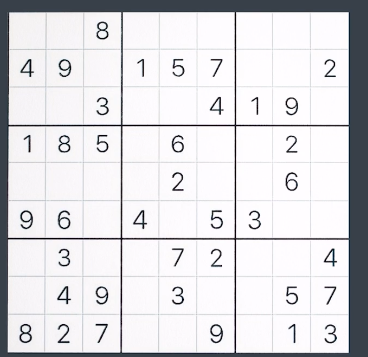

# Bracktracking

##### types of backtracking

1. decision ( yes or no )
2. optimization ( get optimise one )
3. enumeration ( listing )

### backtracking on an array

TC --> O(n) SC --> O(n)

```java
   public static void backtrackArray(int[] arr,int i){
      if(i>=arr.length){
         return;
      }
      arr[i]=i+1;
      backtrackArray(arr, i+1);
      arr[i]=arr[i]-2;
   }
```

or

```java
   public static void backtrackArray(int[] arr,int i){
      if(i<arr.length){
         arr[i]=i+1;
      backtrackArray(arr, i+1);
      arr[i]=arr[i]-2;
      }
   }
```

```java
   public static void backtrackArray(int[] arr,int i){
      if(i>=arr.length){
    return;
      }

        arr[i]=i+1;
      backtrackArray(arr, i+1);
      arr[i]=arr[i]-2;
   }
```

## String Subset

"abc" -> a b c ab bc ac abc (extra "" null set )

total subset =2^n or 2^n -1 ( if null set is not consider ) work for string and array

TC --> O(n*2^n)
total substring --> 2^n * time to cat 1 sub string

SC --> O(n)

```java

   public static void StringSubSet(String str, String ans, int i) {
      if (i == str.length()) {
         if (ans.length() != 0)
            System.out.println(ans);
         return;
      }

      StringSubSet(str, ans + str.charAt(i), i + 1);
      StringSubSet(str, ans, i + 1);
   }

```

## FInd & Print all permutaion of a string "abc" -> abc,acb,bac,bca,cab,cba

for n elements -> total permutation are n!;

O(n\*n!)

```java
   public static void PermutationPair(String str,String ans) {
      if(str.length()==0){
         System.out.println(ans);
         return;
      }

      for(int i=0;i<str.length();i++){
         char ch=str.charAt(i);

        String newstr=str.substring(0, i)+str.substring(i+1);
         PermutationPair(newstr, ans+ch);
      }

   }
```

## N queens

place N queens on an N\*N chessboard such that no 2 queens can attack each other
N=4

all solution
yes / no
count solution

```java

    public static boolean isSafe(char[][] check,int i,int j) {
        for(int row=i-1;row>=0;row--){
            if(check[row][j]=='Q'){
                return false;
            }
        }

        for(int row=i-1,col=j+1;row>=0&&col<check[0].length;row--,col++){
            if(check[row][col]=='Q'){
                return false;
            }
        }

        for(int row=i-1,col=j-1;row>=0&&col>=0;row--,col--){
            if(check[row][col]=='Q'){
                return false;
            }
        }
        return true;
    }

    public static void Nqueen(char[][] board, int i) {

        if(i==board.length){
         printBoard(board);
         return;
        }

        for (int j = 0; j < board[0].length; j++) {
            if(isSafe(board, i, j)){
                board[i][j] = 'Q';
                Nqueen(board, i + 1);
                board[i][j] = '.';
            }
        }
        return ;

    }

    public static  void printBoard(char[][] board){
        System.out.println("-----------");
        for(int i=0;i<board.length;i++){
            for(int j=0;j<board[0].length;j++){
            System.out.print(board[i][j]);
            }
            System.out.println("");
        }

    }

```

## Count N queens

```java

    public static boolean isSafe(char[][] check,int i,int j) {
        for(int row=i-1;row>=0;row--){
            if(check[row][j]=='Q'){
                return false;
            }
        }

        for(int row=i-1,col=j+1;row>=0&&col<check[0].length;row--,col++){
            if(check[row][col]=='Q'){
                return false;
            }
        }

        for(int row=i-1,col=j-1;row>=0&&col>=0;row--,col--){
            if(check[row][col]=='Q'){
                return false;
            }
        }
        return true;
    }

    public static void Nqueen(char[][] board, int i) {

        if(i==board.length){
count ++;
        }

        for (int j = 0; j < board[0].length; j++) {
            if(isSafe(board, i, j)){
                board[i][j] = 'Q';
                Nqueen(board, i + 1);
                board[i][j] = '.';
            }
        }
        return ;

    }

    public static  void printBoard(char[][] board){
        System.out.println("-----------");
        for(int i=0;i<board.length;i++){
            for(int j=0;j<board[0].length;j++){
            System.out.print(board[i][j]);
            }
            System.out.println("");
        }

    }

static int count =0;
```

## N-Queens -print 1 solution

```java

    public static boolean isSafe(char[][] check,int i,int j) {
        for(int row=i-1;row>=0;row--){
            if(check[row][j]=='Q'){
                return false;
            }
        }

        for(int row=i-1,col=j+1;row>=0&&col<check[0].length;row--,col++){
            if(check[row][col]=='Q'){
                return false;
            }
        }

        for(int row=i-1,col=j-1;row>=0&&col>=0;row--,col--){
            if(check[row][col]=='Q'){
                return false;
            }
        }
        return true;
    }

    public static boolean Nqueen(char[][] board, int i) {

        if(i==board.length){
return true;
        }

        for (int j = 0; j < board[0].length; j++) {
            if(isSafe(board, i, j)){
                board[i][j] = 'Q';
                if(Nqueen(board, i + 1)){
                  return true;
                }

            }
              board[i][j] = '.';
        }
        return false ;

    }

    public static  void printBoard(char[][] board){
        System.out.println("-----------");
        for(int i=0;i<board.length;i++){
            for(int j=0;j<board[0].length;j++){
            System.out.print(board[i][j]);
            }
            System.out.println("");
        }

    }

```

## Grid ways

Find number if ways to reach from (0,0) to (N-1,M-1) in a N\*M grid. allowed moves - right or down

```java
public static int gridWays(int i,int j, int n,int m){
        if(i==n-1&&j==m-1){
            return 1;
        }else if(i==n||j==n){
            return 0;
        }

        int w1=gridWays(i+1,j,n,m);
        int w2=gridWays(i,j+1,n,m);
        return w1+w2;
    }

     public static void main(String[] args) {
        int n=3,m=3;
        System.out.println(gridWays(0,0,n,m));

    }
```

need to trace atleast n+m-1
tc=O(2^n+m)

## Math trick for linear time

total characters (n-1) + (m-1)

permutaion of there possible pattern
(n-1+m-1)!/(n-1)!(m-1)!

## Sudoku

write a function to complete a sudoku . ( yes or no)



```java
public static boolean sudokuSolver(int sudoku[][], int row, int col) {
        if(row==9){
            return true;
        }
        int nextRow = row, nextCol = col + 1;
        if (col + 1 == 9) {
            nextRow = row + 1;
            nextCol = 0;
        }
        if(sudoku[row][col]!=0){
            return sudokuSolver(sudoku, nextRow, nextCol);
        }
        for (int digit = 1; digit <= 9; digit++) {
            if (isSafe(sudoku, row, col, digit)) {
                sudoku[row][col] = digit;
                if(sudokuSolver(sudoku, nextRow, nextCol)){
                    return true;
                }
                sudoku[row][col]=0;
            }
        }
            return false;
    }
    public static boolean isSafe(int sudoku[][], int row, int col,int digit){
         for(int i=0;i<=0;i++){
            if(sudoku[i][col]==digit){
                return false;
            }
         }

         for(int j=0;j<=0;j++){
            if(sudoku[row][j]==digit){
                return false;
            }
         }

         int sr=(row/3)*3;
         int sc=(col/3)*3;

         for(int i=sr;i<sr+3;i++){
            for(int j=sc;j<sc+3;j++){
                if(sudoku[i][j]==digit){
                    return false;
                }
            }
        }

        return true;
    }

    public static void main(String[] args) {
        int sudoku[][] = { { 0, 0, 8, 0, 0, 0, 0, 0, 0 }, { 4, 9, 0, 1, 5, 7, 0, 0, 2 }, { 0, 0, 3, 0, 0, 4, 1, 9, 0 },
                { 1, 8, 5, 0, 6, 0, 0, 2, 0 }, { 0, 0, 0, 0, 2, 0, 0, 6, 0 }, { 9, 6, 0, 4, 0, 5, 3, 0, 0 },
                { 0, 3, 0, 0, 7, 2, 0, 0, 4 }, { 0, 4, 9, 0, 3, 0, 0, 5, 7 }, { 8, 2, 7, 0, 0, 9, 0, 1, 3 } };

```

# ArrayList

in build data strucuture and a linear type

Array

- fixed size
- primitive data types can be stored

ArrayList

- dynamic size
- primitive data types
  can't be stored directly

store object of a class

import java.util.ArrayList;
ArrayList<type> list

ArrayList<String> list =new ArrayList<>()
ArrayList<Integer> list2 =new ArrayList<>()
ArrayList<Boolean> list3 =new ArrayList<>()

Operations :-

-> Add Element O(1) list.add(1);
System.ot.println(list) [1]

--> add at a index O(n)
list.add(index,value);
list.add(0,9)

-> Get Element O(1)
list.get(index)

-> Remove Element O(1)
list.remove(2) // index

-> Set Element at Index O(1)
.set(index,value)
.set(2,3)

-> Contains Element O(n)
list.contains(value)
list.contains(1)

return true/false

--> size of an array list
list.size()

#### print reverse of an array list

for(int i=list.size()-1;i>=0;i--){
System.out.println(list.get(i))
}

#### find maximum in an ArrayList

int max=Integer.MAX_VALUE;
for(int i=0;i<list.size();i++){
if(max>list.get(i)){
max=list.get(i);
}
or
max=Math.max(max,list.get(i))
}

#### Swap 2 numbers

int index=0,int sindex=3;
int temp=list.get(index);
list.set(index,list.get(sindex));
list.set(sindex,temp);

##### inbuild method or sorting and array

import java.util.Collections;
Collections.sort(list);

// descringn order
Collections.sort(list,Collections.reverseOrder())

Collections.reverseOrder() -> comparator ( function logic );

in normal function
Arrays.sort(arr);

## Multi-dimensional ArrayList

ArrayList<ArrayList<Integer>> mainList= new ArrayList<>();

ArrayList<Integer> list1 =new ArrayList<>();
list1.add(2) list1.add(3)
ArrayList<Integer> list2 =new ArrayList<>();
list2.add(2) list2.add(3)

mainList.add(list1)
mainList.add(list2)

for(int i;i<mainList.size();i++){
ArrayList<Integer> currList=mainList.get(i);
for(int j;j<currList.size();j++){
System.out.print(currList.get(j))

    }
    System.out.println("");

}

> > add things directly in ArrayList

1.  import java.util.ArrayList;
    import java.util.Arrays;
    ArrayList<String> list = new ArrayList<>(Arrays.asList("Apple", "Banana", "Cherry"));

2.  ArrayList<String> list = new ArrayList<String>() {{
                add("Apple");
                add("Banana");
                add("Cherry");
            }};

3.  ArrayList<String> list = new ArrayList<>();
    Collections.addAll(list, "Apple", "Banana", "Cherry");
    System.out.println(list);

String[] fruits = {"Apple", "Banana", "Cherry"};

        // Create an ArrayList
        ArrayList<String> list = new ArrayList<>();

        // Add the elements of the array to the ArrayList
        Collections.addAll(list, fruits);

4. ArrayList<Object> list = new ArrayList<>();

list.add(new String[]{"Apple", "Banana"});
list.add(new Integer[]{1, 2, 3});
list.add(new Double[]{1.1, 2.2, 3.3});

## Container with most water

For given n lines on x-axis, use 2 lines to form to container such that it holds maximum water.

height=[1,8,6,2,5,4,8,3,7]

1. bruste approach
   find pair and get collected water and get max from a comparitive variable

2. > > Two Pointer approach

```java O(n)
 public static void findMaxWater(ArrayList<Integer> list) {
        int maxWater = 0;
        // 1, 8, 6, 2, 5, 4, 8, 3, 7
        int l = 0;
        int r = list.size() - 1;

        while (l < r) {
            int waterStore = Math.min(list.get(l), list.get(r)) * (r - l);
            maxWater = Math.max(waterStore, maxWater);
            if (list.get(l) > list.get(r)) {
                r--;
            } else {
                l++;
            }
        }

        System.out.println("max water store     "+maxWater);
    }
```

## pair sum - 1

find if any pair in a sorted arraylist has a target sum.

list =[1,2,3,4,5,6] target=5;

```java
public static void findPairSum(ArrayList<Integer> list, int target) {
        int l = 0;
        int r = list.size()-1;

        while (l <= r) {
            int sum = list.get(l) + list.get(r);
            if (sum == target) {
                System.out.println("true");
                return;
            }
            if (sum > target) {
                r--;
            } else {
                l++;
            }

        }
        System.out.println("false");
    }
```

## pair sum - 2

Find if any pair in a sorted & rotated arraylist has a target sum

list =[11,15,6,8,9,10] target=16

```java
 public static boolean findPairSum2(ArrayList<Integer> list, int target) {
        int bp = -1;
        int n = list.size();
        for (int i = 0; i < list.size() - 1; i++) {
            if (list.get(i) > list.get(i = 1)) {
                bp = i;
                break;
            }
        }

        int lp = bp + 1;
        int rp = bp==-1?list.size()-1:bp;

        while (lp != rp) {
            int sum = list.get(lp) + list.get(rp);
            if (sum == target) {
                return true;
            }

            if (list.get(lp) + list.get(rp) < target) {
                lp = (lp + 1) % n;
            } else {
                rp = (n + rp - 1) % n;
            }
        }

        return false;
    }
```

# LinkedList

> > the LinkedList class is an inner class of JavaBasic, and you are trying to create an instance of it directly within the main method without creating an instance of JavaBasic.

JavaBasic javaBasic = new JavaBasic();
LinkedList li = javaBasic.new LinkedList();

[data | next] -> [data | next] -> [data | next] -> [data | null]

Head Node
Tail Node

each node is a object of a class

public class LinkedList{
public static class Node{
int data;
Node next;

    public Node(int data){
       this.data=data;
       this.next=null;
    }

}

public static Node Head;
public static Node tail;

public void addFirst(int data){
// create new node
Node newNode =new Node(data);

    if(head==null){
     head=tail=newNode;
     return ;
    }

    // newNode next =head;
    newNode.next=head;

    // head = newNode;
    head=newNode;

}

public static void main(String args[]){
linkedList li =new LinkedList();
li.head=new Node(1);
li.head.next=new Node(2);

}

}

### Add in linked list

1. add First O(1)

public class LinkedList{
public static class Node{
int data;
Node next;

    public Node(int data){
       this.data=data;
       this.next=null;
    }

}

public static Node Head;
public static Node tail;

public void addFirst(int data){
// create new node
Node newNode =new Node(data);

    if(head==null){
     head=tail=newNode;
     return ;
    }

    // newNode next =head;
    newNode.next=head;

    // head = newNode;
    head=newNode;

}

public static void main(String args[]){
linkedList li =new LinkedList();
li.addFirst(2)

}

}

2. add Last
   create a node
   if(head==null){
   head=tail=newNode;
   }
   tail.next=newNode;
   tail=newNode;

### print linked list

Node temp=head;
while(temp!=null){
print(temp.data)
temp=temp.next;
}

### Add in the middle

add(index,data)

if(idx==0){
addFirst(data);
return;
}
Node newNode=newNode(data)
Node temp=head;
int i=0;

while(i<idx-1){
temp=temp.next;
i++;
}
newNode.next=temp.next;
temp.next=newNode;

### size of linkedlist

will maintain a size in the class
if add a node it will increase and if remove it will descrease

### remove in a linked list

1. Remove First

2. Remove Last

```java
import java.util.*;

public class JavaBasic {
    public static class LinkedList {
        public static Node head;
        public static Node tail;
        public static int size = 0;

        public class Node {
            int data;
            Node next;

            public Node(int data) {
                this.data = data;
                this.next = null;
            }
        }

        public void addFirst(int data) {
            Node newNode = new Node(data);
            size++;
            if (head == null) {
                head = tail = newNode;
                return;
            }

            newNode.next = head;
            head = newNode;
        }

        void printList() {
            Node currentNode = head;
            while (currentNode != null) {
                System.out.print(currentNode.data + "-->");
                currentNode = currentNode.next;
            }
            System.out.println("null");
        }

        void removeFirst() {
            if (head == null) {
                return;
            }
            if(tail==head){
                tail=null;
            }
            head=head.next;
            --size;
        }

        void removeLast(){
            if(tail==null){
               return;
            }
            if(head==tail){
                tail=head=null;
                size--;
                return;
            }

            Node currentNode=head;
            while(currentNode.next != tail){
                currentNode=currentNode.next;
            }
            size--;
            currentNode.next=null;
            tail = currentNode;
        }

    }

    public static void main(String[] args) {
        LinkedList li = new LinkedList();
        li.printList();
        li.printList();
        li.printList();
    }
}
```

### search ( iterative )

Search for a key in a linked list. return the position where it is found. if not found, return -1.

```java
int Search(int n){
            if(head==null){
                return -1;
            }

            int i=0;
            Node currentNode=head;
            while(i<size){
              if(currentNode.data==n){
                return i;
              }
              currentNode=currentNode.next;
              i++;
            }
            return -1;
        }
```

### search ( recursive )
Search for a key in a linked list. return the position where it is found. if not found return -.use recursion.

```java
public int helper(Node head,int key){
            if(head==null){
                return -1;
            }

            if(head.data==key){
              return 0;
            }

            int idx=helper(head.next, key);
            if(idx==-1){
                return -1;
            }
            return idx+1;
        }
```

### Reverse a linked list ( iterative approach )
