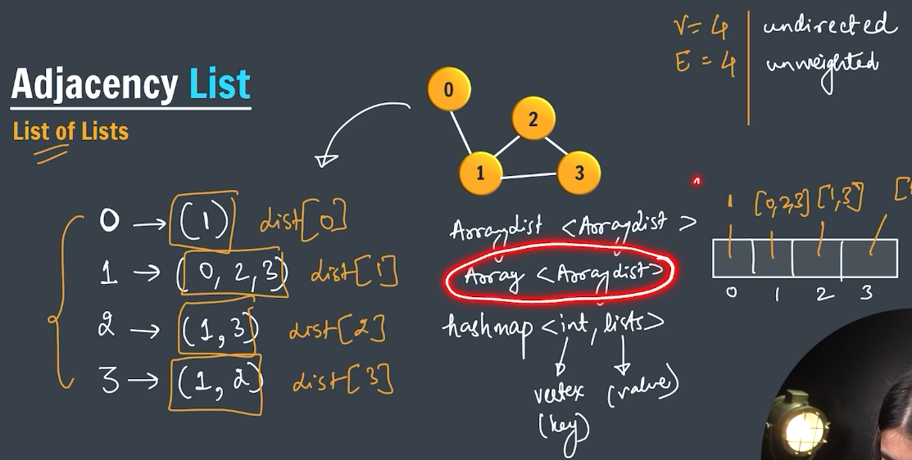

#   Trie Data Structure ( Prefix tree / retrievel tree )
       
       A
     /   \
    L     M
   / \
  L   S
       \
        O

k-ary tree
> Node can have more than one or two child node 
words[]="the","a","there","their","any","ther"

>> use trie when search a word , prefix or strign 

[alt text](./assests/trie.png)

```java
import java.util.*;
public class JavaBasic {
    static class Node{
        Node children[]=new Node[26];
        boolean eow=false;
        Node(){
             for(int i=0;i<26;i++){
                children[i]=null;
             }
        }
    }
    public static Node root =new Node();
    public static void main(String[] args) {
    }
}
```

## Insert in trie O(L) largest word length
words[] ="the" "a" "there" "their" "any" "thee"

```java
 public static void insert(String word){
        Node curr=root;
        for(int i =0;i<word.length();i++){
            int index=(int)(word.charAt(i)-'a');
            if(curr.children[index]==null){
                 curr.children[index]=new Node();
            }
            curr=curr.children[index];
        }
        curr.eow=true;
 }
 ```

## Search in trie O(L)


key ="thee" key ="thor"

```java
 public static boolean search(String word) {
        Node curr = root;
        for (int i = 0; i < word.length(); i++) {
            int index = (int) (word.charAt(i) - 'a');
            if (curr.children[index] == null) {
                return false;
            }
            curr = curr.children[index];
        }
        return curr.eow;
    }
```

## Word Break Problem

given an input string and a dictionary of words, find out if the input string can be broken into a space-sperated sequence of dictionary words.

words[]=(i,like,sam,samsung,mobile,ice)
key="ilikesamsung"

output : true

```java O(n or key lenght )
public static boolean wordBreak(String key) {
        if(key.length()==0){
            return true;
        }

        for (int i = 1; i <= key.length(); i++) {
            if(search( key.substring(0, i))&&wordBreak(key.substring(i))){
                return false;
            } 
        }
        return false;
    }
``` 

## Prefix Problem
FInd Shortest unique prefix for every word in a given list.
assume no word is prefix of another.

arr[]={"zebra","dog","duck","dove"}
ans={"z","dog","du","dov"}

* in class node add frequency =1 option , while creating trie if a node already exist in children increase frequency and continue 
* set freq of root -1 so it not stuck at root
* create a search that stop when node have freq =1 that give shortest prefix

```java
static class Node {
        Node children[] = new Node[26];
        boolean eow = false;
        int freq;
        Node() {
            for (int i = 0; i < 26; i++) {
                children[i] = null;
            }
            freq=1;
        }
    }

    public static void insert(String word) {
        Node curr = root;
        for (int i = 0; i < word.length(); i++) {
            int index = (int) (word.charAt(i) - 'a');
            if (curr.children[index] == null) {
                curr.children[index] = new Node();

            }else{
                curr.children[index].freq++;
            }

            curr = curr.children[index];
        }
        curr.eow = true;
    }

public static void findPrefix(Node root, String ans) {
        if(root==null){
            return;
        }
        if(root.freq==1){
            System.out.println(ans);
            return;
        }
        for (int i = 0; i < root.children.length; i++) {
            if (root.children[i] != null) {
                findPrefix(root.children[i], ans + (char) (i + 'a'));
            }
        }
    }
```

## StartsWith Problem O(L prefix string length)
Create a function boolean startsWith (String prefix) for a trie. Return true if there is a previouly inserted string word that has the prefix, and false otherwise.

words[] = {"apple","app","mongo","man","woman"}
prefix="app" output:true
prefix="moon" output:false

```java
    public static boolean startWith(String prefix){
        Node curr=root;
        for(int i=0;i<prefix.length();i++){
            int index = (int) (prefix.charAt(i) - 'a');
            if (curr.children[index] == null) {
                return false;
            }
            curr = curr.children[index];
        }
        return true;
    }
```

## Count Unique Substrings

Given a string of length n of lowercase alphabet characters, we need to count total number of distinct substrings of this string.

str="ababa"
ans=10

```java

  public static int countNodes(Node root) {
        if (root == null) {
            return 0;
        }

        int count = 0;
        for (int i = 0; i < 26; i++) {
            if (root.children[i] != null) {
                count += countNodes(root.children[i]);
            }
        }
        return count+1 ;
    }


String str = "ababa";
        for (int i = 0; i < str.length(); i++) {
            String suffix = str.substring(i);
            insert(suffix);
        }
```

## LOngest WOrd with all orefixes
FInd the longest string in words such that every prefix of it is also in words
words=["a","banana","app","appl","ap","apply","apple"]

ans="apple  


```java
  public static String ans = "";

public static void longestWOrd(Node root, StringBuilder temp) {
        if (root == null) {
            return;
        }

        for (int i = 0; i < 26; i++) {
            if (root.children[i] != null && root.children[i].eow) {
                char ch = (char) (i + 'a');
                temp.append(ch);
                if (temp.length() > ans.length()) {
                    ans = temp.toString();
                }
                longestWOrd(root.children[i], temp);
                temp.deleteCharAt(temp.length());
            }
        }
    }

        String words[] = { "a", "banana", "app", "appl", "ap", "apply", "applr" };
        for (int i = 0; i < words.length; i++) {
            insert(words[i]);
        }longestWOrd(root,new StringBuilder(""));
        System.out.println(ans);
```


# Graph ( Network of Nodes )

>> vertex (vertices) and edge

##### Edges 


 
;

##### Storing a graph
* Adjacency List
* Adjacency Matrix
* Edge List
* 2D Matrix (Implicit graph)

###### Adjacency List ( List of List )



###### Adjaceny Matrix


###### Edge List


###### 2D Matrix


##### Application of Graph
* google maps (shortest path)
source and destinagtion are vertex and distance is edge
* social network (facebook instagram)
peaple are vertex and they are connected with edge
* Delivery Network (shortest cyclic route) 
* ROuting algorithm
* Machine learning (Computation graphs)


## Create a Graph 
Adjacency List

ArrayList<Edge> Graph[]
Edge={src,dest,weight}

     5
  0 -----1
        /  \ 3
     1 /    \
       2-----3
       |  1
    2  |
       4  

```java

static class Edge {
        int src;
        int dest;
        int wt;
      public Edge(int s,int d, int w){
            this.src=s;
            this.dest=d;
            this.wt=w;
        }
    }

int V=5;
        @SuppressWarnings("unchecked")
        ArrayList<Edge> graph[]=new ArrayList[5];
        for(int i=0;i<V;i++){
            graph[i]=new ArrayList<>();
        }
        graph[0].add(new Edge(0, 1, 5));
        graph[1].add(new Edge(1, 0, 5));
        graph[2].add(new Edge(2, 1, 1));
        graph[2].add(new Edge(2, 3, 1));
        graph[2].add(new Edge(2, 4, 2));
        graph[3].add(new Edge(3, 2, 1));
        graph[3].add(new Edge(3, 1, 3));
        graph[4].add(new Edge(4, 2, 2));
        
        for(int i=0;i<graph[2].size();i++){
            Edge e=graph[2].get(i);
            System.out.println(e.dest);
        }
```

## Graph Traversals

###### Breadth First Search (BFS)
* Go to immediate neighbors first
* need queue and a boolean arrany
* Source COuld be any

```java O(V+E) -> 
public static void bfs(ArrayList<Edge> graph[]){
        Queue<Integer> q=new LinkedList<>();
        boolean track[]=new boolean[graph.length];
        q.add(0);

        while(q.isEmpty()){
            int number=q.remove();
            if(!track[number]){
                track[number]=true;
                System.out.println(number);
                for(int i=0;i<graph[number].size();i++){
                    Edge ee=graph[number].get(i);
                    q.add(ee.dest);
                }
            }
        }
    }
```

###### Depth First Search (DFS)
* Kepp going to the 1st neighbor
* use recursion and boolean track arrray 

```java
    public static void dfs(ArrayList<Edge> graph[],int curr,boolean vis[]){
        System.out.print(curr+" ");
        vis[curr]=true;

        for(int i=0;i<graph[curr].size();i++){
            Edge e=graph[curr].get(i);
            if(!vis[e.dest]){
                dfs(graph,e.dest,vis);
            }
        }
    }
```

## Has Path
fogiven src & dest, tell if a path exist from src to dest

      0
    /   \
   2     1
   |     |
   4-----3
   \     /
    \   /
      5
      |
      6
src=0 dist = 5

```java O(V+E)
public static boolean hasPath(ArrayList<Edge> graph[],boolean visit[],int src,int dist){
        visit[src]=true;
        for(int i=0;i<graph[src].size();i++){
            Edge ee=graph[src].get(i);
            if(ee.dest==dist){
                return true;
            }
            if(!visit[ee.dest]){
                boolean check= hasPath(graph, visit, ee.dest, dist);
                if(check){
                    return check;
                }
            }
            // ------ or
            //   if(!visit[ee.dest]&&hasPath(graph, visit, ee.dest, dist);){
            //         return true;
            // }
        }
        return false;
    }
```

## Connected component
* Its not neccessary a vertex alteast connected to any other vertex 
* due to above condition its not neccessary with vertex we can traverse to last vertex 

>> To tackle this we  can use dfs util function


```java
    public static void dfs(ArrayList<Edge>[] graph) {
        boolean vis[] = new boolean[graph.length];
        for (int i = 0; i < graph.length; i++) {
            dfsUtil(graph, i, vis);
        }
    }

    public static void dfsUtil(ArrayList<Edge> graph[], int curr, boolean vis[]) {
        System.out.print(curr + " ");
        vis[curr] = true;

        for (int i = 0; i < graph[curr].size(); i++) {
            Edge e = graph[curr].get(i);
            if (!vis[curr]) {
                dfsUtil(graph, e.dest, vis);
            }
        }
    }


        public static void bfs(ArrayList<Edge> graph[]){
        boolean track[] = new boolean[graph.length];
        for(int i=0;i<graph.length;i++){
            if(!track[i])
            bfsUtils(graph, track);
        }

    }

    public static void bfsUtils(ArrayList<Edge> graph[],boolean track[]) {
        Queue<Integer> q = new LinkedList<>();
        q.add(0);

        while (q.isEmpty()) {
            int number = q.remove();
            if (!track[number]) {
                track[number] = true;
                System.out.println(number);
                for (int i = 0; i < graph[number].size(); i++) {
                    Edge ee = graph[number].get(i);
                    q.add(ee.dest);
                }
            }
        }
    }
```

## Cycle Detection
if cycke return true else false

      0
    /   \
   2     1
   |     |
   4-----3
   \     /
    \   /
      5
      |
      6
>> using modified DFS

```java O(V+E)
 public static boolean detectCycle(ArrayList<Edge> graph[]) {
        boolean vis[] = new boolean[graph.length];
        for (int i = 0; i < graph.length; i++) {
            if (!vis[i]) {
                if (detectCycleUtils(graph, vis, i, -1))
                    return true;
            }
        }
        return false;
    }

    public static boolean detectCycleUtils(ArrayList<Edge>[] graph, boolean vis[], int curr, int par) {
        vis[curr] = true;

        for(int i=0;i<graph[curr].size();i++){
            Edge ee=graph[curr].get(i);
            if(!vis[ee.dest]){
                if(&& detectCycleUtils(graph,vis,ee.dest,curr))
                return true;
            }else if (vis[ee.dest]&&ee.dest!=par){
                return true;
            }
        }
        return false;
    }
```

## Bipartite Graph
A bipartite graph is a graph whose vertices can be divided into two independent sets. U and V such that every edge (u,v) either connects a vertex from U to V or a  vertex from V to U. In order words, for every edges (u,v), either u belongs to U and v to V, or u belongs to V and v to U, we can also say that there is no edge that connects vertices of same set


set1 (U)   set2(V)


>> will use graph coloring technique
>> Acyclic true
>> Even Cycle true
>> odd cycle false
>> for above 3 point first find graph is cyclic than caluclate no of vertex
>> if graph is not cyclic it will be bipartite

```java O(V+E)
    public static boolean isBipartite(ArrayList<Edge>[] graph) {
        int col[] = new int[graph.length];
        for (int i = 0; i < col.length; i++) {
            col[i] = -1;
        }
        Queue<Integer> q = new LinkedList<>();
        for (int i = 0; i < graph.length; i++) {
            if (col[i] == -1) {
                q.add(i);
                col[i] = 0;
                while (!q.isEmpty()) {
                    int curr = q.remove();
                    for(int j=0;j<graph[curr].size();j++){
                        Edge e=graph[curr].get(i);
                        if(col[e.dest]==-1){
                            int nextCol=col[curr]==0?1:0;
                            col[e.dest]=nextCol;
                            q.add(e.dest);
                        }else if(col[e.dest]==col[curr]){
                            return false;
                        }
                    }
                }
            }
        }
        return true;
    }
```

## Cycle Detection in Directed graph (DFS)


  


* maintain a stack in recurssion if the neighour is already in the stack means it is cyclic

```java
 public static boolean isCycle(ArrayList<Edge> graph[]) {
        boolean vis[] = new boolean[graph.length];
        boolean stack[] = new boolean[graph.length];

        for (int i = 0; i < graph.length; i++) {
            if (!vis[i]) {
                if (isCycleUtils(graph, i, vis, stack)) {
                    return true;
                }
            }
        }
        return false;
    }

    public static boolean isCycleUtils(ArrayList<Edge>[] graph, int curr,boolean vis[],boolean stack[]){
        vis[curr]=true;
        stack[curr]=true;

        for(int i=0;i<graph[curr].size();i++ ){
            Edge e=graph[curr].get(i);
            if(stack[e.dest]){
                return true;
            }
            if(!vis[e.dest]&&isCycleUtils(graph, e.dest, vis, stack)){
                return true;
            }
        }  
        stack[curr]=false;
        return false;
    }
```

>> It may possible to find cycle in graph using BFS BUT We choose DFS over BFS because we have to follows a path that helps more 

## Topological SOrting 
^ Directed acyclic graph(DAG) is a directed praph with no cycles.
* Topological sorting is used only for DAGs (not for non-DAGs)
* it is a linear order of vertices such that every directed edge u -> v, the vertex u comes before v in the order.
 

> will maintain a stack 

```java
  public static void topSort(ArrayList<Edge> graph[]) {
        boolean vis[] = new boolean[graph.length];
        Stack<Integer> s = new Stack<>();
        for (int i = 0; i < graph.length; i++) {
            if (!vis[i]) {
                topSortUtils(graph, i, vis, s);
            }
        }
        while (s.isEmpty()) {
            System.out.println(s.pop());
        }
    }
    public static void topSortUtils(ArrayList<Edge> graph[], int curr, boolean vis[], Stack<Integer> s) {
        vis[curr] = true;
        for(int i=0;i<graph.length;i++){
            Edge e=graph[curr].get(i);
            if(!vis[i]){
                topSortUtils(graph, e.dest, vis, s);
            }
        }
        s.push(curr);
    }
```

## Topological SOrt using BFS (Kahn's algorithm)


Fact: A DAG has at least one vertex with in-degree 0 and one vertex with out -degree 0


>> will use in degree

```java
public static void calcIndeg(ArrayList<Edge> graph[], int indeg[]){
        for(int i=0;i<graph.length;i++){
            int v=1;
            for(int j=0;j<graph[v].size();j++){
                Edge e =graph[v].get(j);
                indeg[e.dest]++;
            }
        }
    }
    public static void topSortBfs(ArrayList<Edge> graph[]){
        int indeg[]=new int[graph.length];
        Queue<Integer> q =new LinkedList<>();

        for(int i=0;i<indeg.length;i++){
            if(indeg[i]==0){
                q.add(i);
            }
        }
        while(!q.isEmpty()){
            int curr=q.remove();
            System.out.println(curr+"");
            for(int i=0;i<graph[curr].size();i++){
                Edge e=graph[curr].get(i);
                indeg[e.dest]--;
                if(indeg[e.dest]==0){
                  q.add(e.dest);
                }
            }
        }
        System.out.println("");
    }
```

## All Paths from source to target
directed graph s=5 d=1


```java O(V^v)
    public static void printAllPath(ArrayList<Edge> graph[],int src,int dest,String path){
        if(src==dest){
            System.out.println(path+dest);
        }
        for(int i=0;i<graph[src].size();i++){
            Edge e=graph[src].get(i);
            printAllPath(graph, e.src, dest, path+src);
        }
    }
```

## Dijkstra's algorithm
Shortest path from the source to all vertices (weighted graph)


```java O(V+ElogV) nlogn
static class Pair implements Comparable<Pair>{
        int n; int path;
        public Pair(int n,int path){
            this.n=n;
            this.path=path;
        }
        @Override
        public int compareTo(JavaBasic.Pair arg0) {
            return this.path-arg0.path; 
        }
    }

    public static void dijkstra(ArrayList<Edge> graph[],int src){
        int dist[] = new int [graph.length];
        boolean vis[] = new boolean [graph.length];
        for(int i=0;i<graph.length;i++){
            if(i!=src){
                dist[i]=Integer.MAX_VALUE;
            }
        }

        PriorityQueue<Pair> pq= new PriorityQueue<>();
        pq.add(new Pair(src,0));

        while(!pq.isEmpty()){
            Pair curr=pq.remove();
            if(!vis[curr.n]){
                vis[curr.n]=true;

                for(int i=0;i<graph[curr.n].size();i++){
                    Edge e=graph[curr.n].get(i);
                    int u=e.src;
                    int v=e.dest;
                    int wt=e.wt;

                    if(dist[u]+wt<dist[v]){
                        dist[v]=dist[u]+wt;
                        pq.add(new Pair(v,dist[v]));
                    }
                }
            }
        }
        for(int i=0;i<dist.length;i++){
            System.out.print(dist[i]+" ");
        }
        System.out.println();
    }
```

>> dijkstra algorithm goes not garunttee wheather final anawer will be correct  where a graph can contain negative weight

## Bellma FOrd Algorithm
Shortest path from the source to all vertices (negartive edges)

took more TC than Dijkstra algo

it does not work with negative weight cycle

```java O(V*E)
public static void bellmanFord(ArrayList<Edge> graph[],int src){
        int dist[] = new int[graph.length];
        for(int i=0;i<dist.length;i++){
            if(i!=src){
                dist[i]=Integer.MAX_VALUE;
            }
        }
        int V=graph.length;
        for(int i=0;i<V-1;i++){
            for(int j=0;j<graph.length;j++){
                for(int k=0;k<graph[j].size();k++){
                    Edge e =graph[j].get(k);
                    int u=e.src;
                    int v=e.dest;
                    int wt=e.wt;
                    if(dist[u]!=Integer.MAX_VALUE&&dist[u]+wt<dist[v]){
                        dist[v]=dist[u]+wt;
                    }
                }
            }
        }
        for(int i=0;i<dist.length;i++){
            System.out.print(dist[i]+"");
        }
        System.out.println();
    }
```

## Bellma ford algorithem using edge based graph

in main 
```java
int V=5;
ArrayList<Edge> edges = new ArrayList<>();
createGraph2(edges)
```
```java
createGraph2(ArrayList<Edge> graph){
graph.add(new Edge(0,1,2))
graph.add(new Edge(0,2,4))
graph.add(new Edge(1,2,-4))
graph.add(new Edge(2,3,2))
graph.add(new Edge(3,4,4))
graph.add(new Edge(4,1,-1))
}
here V is total vertices 
public static void bellmanFord
(ArrayList<Edge> graph,int src,int V){
        int dist[] = new int[V];
        for(int i=0;i<dist.length;i++){
            if(i!=src){
                dist[i]=Integer.MAX_VALUE;
            }
        }
        for(int i=0;i<V-1;i++){
           for(int j=0;j<graph.size();j++){
                    Edge e =graph.get(j);
                    int u=e.src;
                    int v=e.dest;
                    int wt=e.wt;
                    if(dist[u]!=Integer.MAX_VALUE&&dist[u]+wt<dist[v]){
                        dist[v]=dist[u]+wt;
                    }
                }
        }
        for(int i=0;i<dist.length;i++){
            System.out.print(dist[i]+"");
        }
        System.out.println();
    }


```


## Minimum spanning tree (MST)


## Prim's Algorithm


```java
    static class Pairs implements Comparable<Pairs> {
        int v;
        int cost;

        public Pairs(int v, int c) {
            this.v = v;
            this.cost = c;
        }

        @Override
        public int compareTo(JavaBasic.Pairs arg0) {
            return this.cost - arg0.cost;
        }
    }

    public static void primts(ArrayList<Edge> graph[]) {
        boolean vis[] = new boolean[graph.length];
        PriorityQueue<Pairs> pq = new PriorityQueue<>();
        pq.add(new Pairs(0, 0));
        int finalCost = 0;

        while (!pq.isEmpty()) {
            Pairs curr = pq.remove();
            if (!vis[curr.v]) {
                vis[curr.v] = true;
                finalCost += curr.cost;
               
                for(int i=0;i<graph[curr.v].size();i++){
                    Edge e=graph[curr.v].get(i);
                    pq.add(new Pairs(e.dest,e.wt));
                }
            }
        }
        System.out.println(finalCost);
    }
```

## Cheapest flights within K stops
there are n cities connected by some number of flights. You are given an array flights where flights[i] = [from , to , price] indicates that there is a flight.

you are also given three integers src, dest,and k , return the cheapest price from src to dst with at most k stops if there is no such route, return -1.

all values are positive 

flights = [[0,1,100],[1,2,100],[0,2,500]]
src = 0, dst = 2, k=1
ans = 200

       0
 100 /   \ 100
    /     \
    2------1
      100

```java
import java.util.*;

public class Java {
    public static class Edge {
        int src;
        int dest;
        int wt;

        public Edge(int s, int d, int wt) {
            this.src = s;
            this.dest = d;
            this.wt = wt;
        }
    }

    public static void createGraph(int flights[][], ArrayList<Edge> graph[]) {
        for (int i = 0; i < graph.length; i++) {
            graph[i] = new ArrayList<>();
        }
        for (int i = 0; i < flights.length; i++) {
            int src = flights[i][0];
            int dest = flights[i][1];
            int wt = flights[i][2];

            Edge e = new Edge(src, dest, wt);
            graph[src].add(e);
        }
    }

    public static class Info {
        int v;
        int cost;
        int stops;

        public Info(int v, int c, int s) {
            this.v = v;
            this.cost = c;
            this.stops = s;
        }
    }

    public static int cheapestFlight(int n, int flights[][], int src, int dest, int k) {
        ArrayList<Edge> graph[] = new ArrayList[n];
        createGraph(flights, graph);

        int dist[] = new int[n];

        for (int i = 0; i < n; i++) {
            if (i != src) {
                dist[i] = Integer.MAX_VALUE;
            }
        }

        Queue<Info> q = new LinkedList<>();
        q.add(new Info(src, 0, 0));

        while (!q.isEmpty()) {
            Info curr = q.remove();
            if (curr.stops > k) {
                break;
            }

            for (int i = 0; i < graph[curr.v].size(); i++) {
                Edge e = graph[curr.v].get(i);
                int u = e.src;
                int v = e.dest;
                int wt = e.wt;

                if (dist[u] != Integer.MAX_VALUE && curr.cost + wt < dist[v]) {
                    dist[v] = dist[u] + wt;
                    q.add(new Info(v, dist[v], curr.stops + 1));

                }
            }
        }

        if (dist[dest] == Integer.MAX_VALUE) {
            return -1;
        } else {
            return dist[dest];
        }
    }

    public static void main(String arg[]) {
        int n = 4;
        int flights[][] = { { 0, 1, 100 }, { 1, 2, 100 }, { 2, 0, 100 }, { 1, 3, 600 }, { 2, 3, 200 } };
        int src = 0, dist = 3, k = 1;
        cheapestFlight(n, flights, src, dist, k);

    }
}
```

## COnnecting CIties with Minum COst 
FInd the minumum cost for connecting all cities on the map

cities[][] ={
    {0,1,2,3,4}
    {1,0,5,0,7}
    {2,5,0,6,0}
    {3,0,6,0,0}
    {4,7,0,0,0}
}

ans = 10


same as MST

```java
    
    static class Edge implements Comparable<Edge>{
        int dest;
        int cost;

        public Edge(int d,int c){
            this.dest=d;
            this.cost=c;
        }

        @Override
        public int compareTo(Java.Edge arg0) {
            return  this.cost - arg0.cost;
        }

    }

    public static int connectCities(int cities[][]){
        PriorityQueue<Edge> pq=new PriorityQueue<>();
        boolean vis[] =  new boolean[cities.length];

        pq.add(new Edge(0,0));

        int finalCost=0;

        while(!pq.isEmpty()){
            Edge curr=pq.remove();
            if(!vis[curr.dest]){
                vis[curr.dest]=true;
                finalCost+=curr.cost;
            
                for(int i=0;i<cities[curr.dest].length;i++){
                    if(cities[curr.dest][i]!=0){
                        pq.add(new Edge(i, cities[curr.dest][i]));
                    }
                }
            }
        }

        return finalCost;
    }
```

## Disjoint set Data structure / union find DS 


used in 
* cycle detection
* kruskal algorithm  

find :- find one to which set it belongs / leader / parent
union :- join two set
 
>> Implements
Parent + Union by rank

union(1,3)
find(3)
union(2,4)
union(3,6)
union(1,4)
find(3)
union(1,5)

[] parent / group leader

[] rank

* create 2 array parent and rank initial self is parent and rank is 0.
* rank is height of tree

> union leaders
> rank parent A = rank parent B
join any one with any one , than change parent

> rank parent A < rank parent B
parent A connect Parent B, and change parent Of A and vice-versa


```java
import java.util.PriorityQueue;

public class Java {

    static int n = 7;
    static int par[] = new int[n];
    static int rank[] = new int[n];

    public static void init() {
        for (int i = 0; i < n; i++) {
            par[i] = i;
        }
    }

    public static int find(int x) {
        if (x == par[x]) {
            return x;
        }
        return find(par[x]);
    }

    public static void union(int a, int b) {
        int parA = find(a);
        int parB = find(b);

        if(rank[parA]==rank[parB]){
            par[parB]=parA;
            rank[parA]++;
        }else if(rank[parA] < rank[parB]){
            par[parA]=parB;
        }else{
            par[parB]=parA;
        }
    }
    public static void main(String arg[]) {
        // union(1,3)
        // find(3)
        // union(2,4)
        // union(3,6)
        // union(1,4)
        // find(3)
        // union(1,5)
    }
}
```


